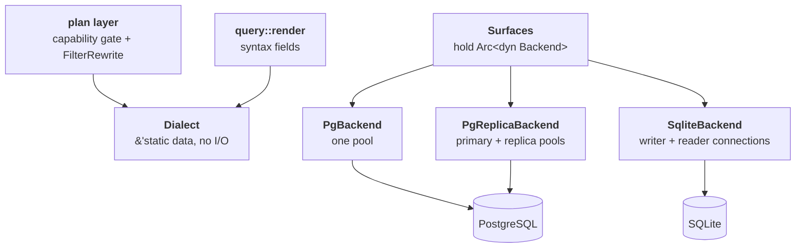
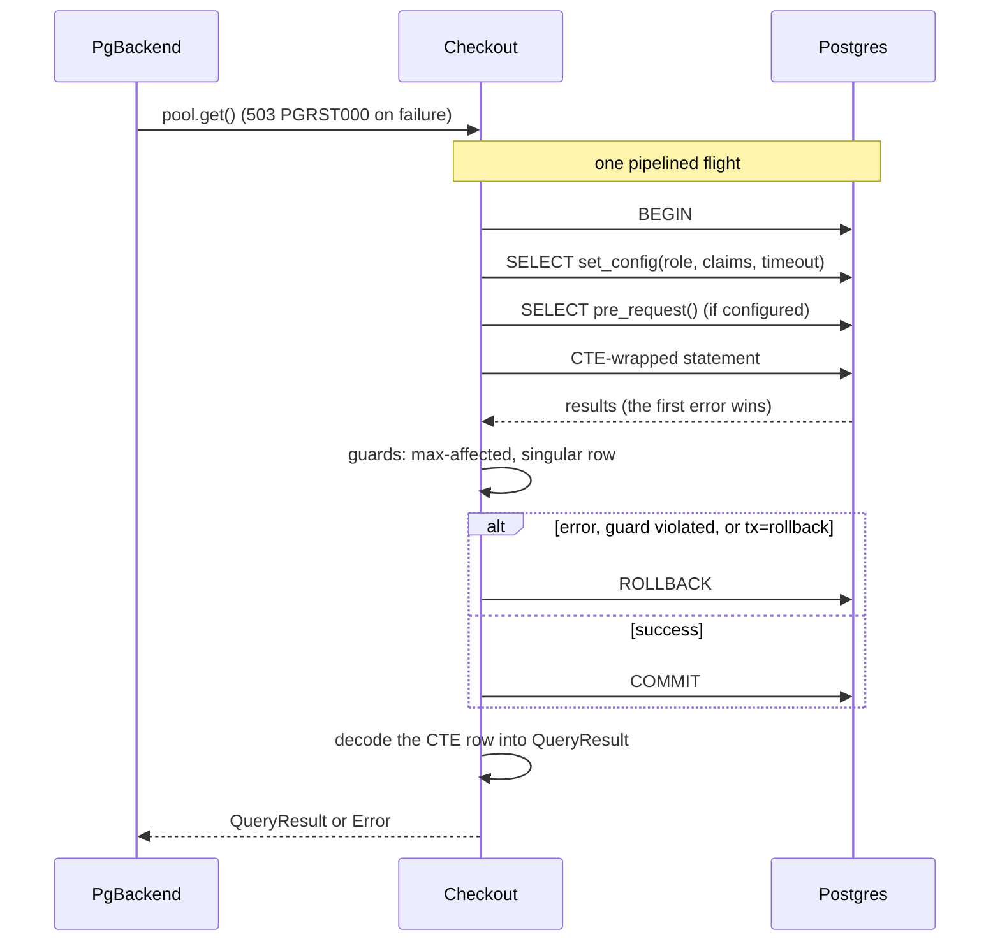
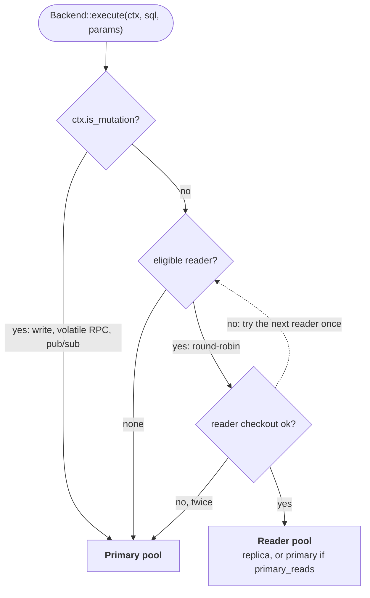
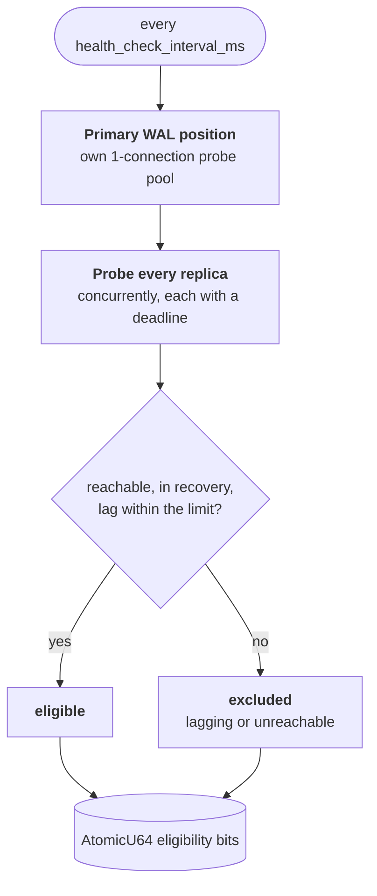

# 03 — Backends and Dialects

How pgvis stays database-agnostic. There are two distinct mechanisms, and the
split between them is the central design idea:

- **`Backend` trait** — the *async I/O boundary*. Connection pooling, query
  execution, schema introspection, change notifications. One trait, implemented
  per database. **Status: `[Implemented]`** for Postgres (`introspect`,
  `execute`, `watch_schema` via `LISTEN pgrst`, `pool_status`) and SQLite
  (`introspect`, `execute`; no schema watch).
- **`Dialect` struct** — *pure data* describing SQL syntax and capability
  differences. No I/O, no trait, no dynamic dispatch. **Status: `[Implemented]`**
  (`POSTGRES` and `SQLITE` constants both defined).

The planner and SQL builder only read the `Dialect` data; surfaces only see
`Arc<dyn Backend>`, never a concrete driver.



## The `Backend` trait

Defined in [pgvis-core/src/backend.rs](../crates/pgvis-core/src/backend.rs):

```rust
pub trait Backend: Send + Sync + 'static {
    fn introspect(&self, cfg: &IntrospectConfig)
        -> BoxFuture<'_, Result<SchemaCache, Error>>;

    fn execute(&self, ctx: &ExecContext, sql: &str, params: &[Value])
        -> BoxFuture<'_, Result<QueryResult, Error>>;

    fn watch_schema(&self) -> BoxFuture<'_, Option<SchemaChangeStream>> { /* None */ }

    fn dialect(&self) -> &'static Dialect;

    fn pool_status(&self) -> Option<PoolStatus> { /* None */ }
}
```

Design choices baked into this signature (see also
[07-design-decisions.md](07-design-decisions.md)):

- **Object-safe via `BoxFuture`.** Methods return `futures::future::BoxFuture`
  rather than using `async fn`, so adapters can hold `Arc<dyn Backend>` and
  never name a concrete driver type. The one allocation per call is negligible
  next to network I/O.
- **`serde_json::Value` params.** The SQL builder emits generic JSON values; the
  driver converts them to native wire types. This keeps the builder
  driver-free.
- **One `execute`, not per-operation methods.** Because the SQL builder fully
  renders the CTE-wrapped statement, the backend just runs the string and
  decodes the uniform [`QueryResult`](../crates/pgvis-core/src/backend.rs).
- **Synchronous `dialect()`.** Returns `&'static Dialect` — cheap, no I/O,
  callable from the hot SQL path.

### Supporting types

All in [backend.rs](../crates/pgvis-core/src/backend.rs):

| Type | Role |
| ------ | ------ |
| `IntrospectConfig` | which schemas to expose + `extra_search_path` for type/function resolution |
| `ExecContext` | per-request session setup: `role`, JWT `claims`, `pre_request`, `statement_timeout`, `tx_end`; routing hint `is_mutation`; `raw_body`; mutation guards `max_affected` and `single_row` |
| `QueryResult` | decoded CTE result: `body` (or `raw_body`, the database's JSON text), `total_count`, `page_total`, `response_status`, `response_headers`, `was_insert` |
| `SchemaChangeStream` | `Pin<Box<dyn Stream<Item=()> + Send>>` — push schema-reload signal |
| `PoolStatus` | pool occupancy (`max_size`, `size`, `available`, `waiting`), reported by `pool_status()` |

`ExecContext` is how row-level security and PostgREST-style GUC behaviour reach
the database: on Postgres the backend opens a transaction and sets `role`,
`request.jwt.claims` and `statement_timeout` with transaction-local
`set_config(..., true)` (the same effect as `SET LOCAL`), optionally calls the
pre-request function, then runs the statement. Per-claim
`request.jwt.claim.<key>` GUCs are not set; `request.jwt.claims` carries every
claim, as in current PostgREST. On SQLite the role and claims are ignored.

### The Postgres implementations

#### `PgBackend` — single-server

[`PgBackend`](../crates/pgvis-postgres/src/lib.rs) wraps a
`deadpool-postgres::Pool` (lazy connections; created from a DSN). It:

- `introspect()` — gets a pooled client and calls
  `introspect::load_schema_cache` ([05-schema-cache.md](05-schema-cache.md)).
- `execute()` — checks out a connection as a `Checkout` guard and calls
  `execute::execute_query`
  ([execute.rs](../crates/pgvis-postgres/src/execute.rs)); see the sequence
  below. A failed checkout (pool exhausted or database unreachable) is 503
  `PGRST000`, as in PostgREST.
- `watch_schema()` — `LISTEN pgrst` on a dedicated connection
  ([schema_watch.rs](../crates/pgvis-postgres/src/schema_watch.rs)); see
  [05-schema-cache.md](05-schema-cache.md).
- `dialect()` — returns `&pgvis_core::dialect::POSTGRES`.
- `pool_status()` — occupancy of the request pool.

**The pipelined executor.** `execute_query` sends BEGIN, one batched
`SELECT set_config($1, $2, true), …` for every GUC, the optional pre-request
call and the CTE-wrapped statement as one pipelined flight (`futures::join!`
over unnamed `query_typed` statements: no per-request PREPARE, safe behind
transaction-mode poolers). Parameters are bound by a `TextParam` `ToSql`
wrapper in the text format, so Postgres coerces them by inferred type. The
mutation guards are checked against the CTE's `page_total` before the
transaction ends, so a violation rolls the writes back. That makes two round
trips per request regardless of how many claims the JWT carries.



There is no RAII transaction, so `Checkout` guards the connection instead: if
the request future is dropped mid-flight (client disconnect, timeout), its
`Drop` detaches the connection from the pool and closes it, and the server
rolls the open transaction back. A connection still inside a transaction, with
the caller's role set, is never handed to the next request. The body is
decoded only after COMMIT/ROLLBACK, so locks and the connection are not held
while JSON is parsed; table reads skip parsing entirely and forward the
database's JSON text (`ExecContext::raw_body`).

**Pool lifecycle configuration:** Pool creation is centralized in
[`create_pool()`](../crates/pgvis-postgres/src/lib.rs) which applies all
settings from [`PoolConfig`](../crates/pgvis-core/src/config.rs):

| Layer | Settings | Purpose |
|-------|----------|---------|
| Connection-level | `keepalives`, `keepalives_idle`, `connect_timeout` | TCP health; detect dead sockets through NATs/LBs |
| Pool-level | `max_size`, `wait`/`create`/`recycle` timeouts | Bound resource usage and prevent unbounded waits |
| Manager-level | `recycling_method` (Fast/Verified/Clean) | Validate connections on checkout; trade latency for safety |

Both `PgBackend` and `PgReplicaBackend` share the same `create_pool` function,
so identical pool settings apply uniformly to the primary and all replica pools
(the replica health probes reuse it with `size = 1` and short timeouts).

#### `PgReplicaBackend` — primary + read replicas `[Implemented]`

[`PgReplicaBackend`](../crates/pgvis-postgres/src/replica.rs) extends the
single-server model with replica-aware routing:

Every read picks an eligible reader from the health bitfield; writes, and
anything that may write, stay on the primary.



**Routing logic:**
- `is_mutation = true` → always the primary pool. The router sets it for
  mutations *and* for calls to `VOLATILE` functions (`plan_writes`), and the
  pub/sub handlers set it for their statements (NOTIFY, the authorize
  function), so nothing that may write reaches a standby.
- `is_mutation = false` → round-robin across eligible readers (replicas +
  optionally the primary); on a checkout failure the next eligible reader is
  tried once.
- No eligible reader, or both tries failed → the primary.

**Health monitoring:** A background task runs every `health_check_interval_ms`
(default 5 s). It probes over its **own one-connection pools** with short
timeouts (the interval clamped to 0.5–5 s), never the request pools: probing
through a saturated request pool made a healthy but busy replica look
unreachable, excluding it and piling its load onto the rest. Each tick reads
`pg_current_wal_lsn()` on the primary, then checks every replica concurrently,
each under its own deadline, comparing `pg_last_wal_replay_lsn()` (the
position visible to queries) with the primary's. Replicas more than
`max_replication_lag_bytes` (default 10 MB) behind, unreachable, or not in
recovery are excluded. When lag checking is disabled or the primary cannot be
read, the check falls back to connectivity only (`SELECT 1`). The result is
stored in an atomic `u64` bitfield (at most 64 readers) for lock-free routing.



`PgReplicaBackend::eligible_readers()` reports how many readers passed the last
check; `pool_status()` reports the primary's pool, which takes every write.
Introspection runs on the primary, and `watch_schema()` listens on the
primary, where DDL is made and announced.

**Failover:** pgvis does NOT handle promotion. External tools (Patroni,
pg_auto_failover, DNS/VIP) handle that. `deadpool-postgres` evicts broken
connections; when the DSN resolves to a new primary, the next pool checkout
reconnects automatically.

**Configuration:** See [`ReplicaConfig`](../crates/pgvis-core/src/config.rs)
in `Config.replica`:
- `replica_dsns` — list of replica connection strings
- `max_replication_lag_bytes` — lag threshold (0 disables checking)
- `health_check_interval_ms` — monitor tick interval
- `primary_reads` — whether primary participates in read load balancing

**Activation:** Automatic via the Builder. When `config.replica.replica_dsns`
is non-empty and the DSN is Postgres, `pgvis-lib` constructs
`PgReplicaBackend` instead of `PgBackend`. No surface-layer changes needed.

## The `Dialect` struct

Defined in [pgvis-core/src/dialect.rs](../crates/pgvis-core/src/dialect.rs). It
is a flat struct of syntax fields and boolean capability flags, *not* a trait.

Rationale: a `dyn Dialect` trait would mean a virtual call for every SQL
fragment — thousands per complex query. A flat `&'static` struct is
branch-prediction-friendly and zero-cost to pass around. Capability decisions
are made *once* in the plan layer, not re-derived per fragment.

### Syntax fields

| Field | Postgres | SQLite |
| ------- | ---------- | -------- |
| `identifier_quote` | `"` | `"` |
| `placeholder` | `Numbered` (`$1`) | `Question` (`?`) |
| `json_array_agg` | `json_agg` | `json_group_array` |
| `json_object` | `json_build_object` | `json_object` |

`Placeholder::render(n)` produces the placeholder text; `RenderContext`
([02-core-pipeline.md](02-core-pipeline.md)) calls it.

### Capability flag matrix

From the `POSTGRES` and `SQLITE` constants in
[dialect.rs](../crates/pgvis-core/src/dialect.rs):

| Flag | Postgres | SQLite | Effect when false |
| ------ | :--------: | :------: | ------------------- |
| `supports_returning` | ✓ | ✓ | no `RETURNING`; mutation return needs a re-select |
| `supports_roles` | ✓ | ✗ | `ExecContext.role` ignored (no RLS) |
| `supports_listen_notify` | ✓ | ✗ | no push schema reload; poll/watch instead |
| `supports_set_local` | ✓ | ✗ | no GUC readback; `response_status/headers` always `None` |
| `schema_namespacing` | ✓ | ✗ | table refs drop the schema qualifier |
| `has_routines` | ✓ | ✗ | no `/rpc/*` routes, no `call_*` MCP tools |
| `supports_aggregates` | ✓ | ✓ | `select=col.sum()` rejected |
| `supports_ilike` | ✓ | ✗ | rewrite `ILIKE` → `LOWER() LIKE LOWER()` |
| `supports_regex_match` | ✓ | ✗ | `match`/`imatch` rejected or rewritten |
| `supports_fts` | ✓ | ✓ | full-text search rejected (different syntax per DB) |
| `supports_array_ops` | ✓ | ✗ | `cs`/`cd`/`ov` rejected |
| `supports_range_ops` | ✓ | ✗ | range operators rejected |
| `supports_estimated_count` | ✓ | ✗ | `count=estimated` falls back to `exact` |
| `supports_quantifiers` | ✓ | ✗ | `op(any)`/`op(all)` rejected or fanned out |
| `supports_set_timezone` | ✓ | ✗ | `Prefer: timezone` ignored |
| `supports_is_distinct` | ✓ | ✗ (conservative) | `IS DISTINCT FROM` avoided |
| `supports_row_to_json` | ✓ | ✗ | embeds serialize with explicit `json_object(...)` |
| `supports_json_recordset` | ✓ | ✗ | INSERT binds one parameter per value instead of one JSON parameter (`json_populate_recordset`) |
| `escape_string_literals` | ✓ | ✗ | JSON-path keys rendered as plain `'...'` instead of `E'...'` |

`row_identifier` (`ctid` on Postgres, `rowid` on SQLite) is the system column
used for limited PATCH/DELETE (`WHERE <id> IN (SELECT <id> … LIMIT n)`).

### How dialect gating works

Two phases, never re-checked in the SQL builder:

1. **Plan-time rejection.** `validate::validate_dialect_support`
   ([plan/validate.rs](../crates/pgvis-core/src/plan/validate.rs)) returns an
   `Error::Unsupported` (HTTP 400, code `PGV001`) when a request needs a
   capability the dialect lacks — e.g. an array operator on SQLite, or an
   `/rpc/*` call when `has_routines` is false.
2. **Plan-time rewrite annotation.** When an operator is *expressible
   differently* rather than impossible, the planner attaches a `FilterRewrite`
   to the `ResolvedFilter` (`InstrFallback` for ILIKE as
   `LOWER() LIKE LOWER()`, `JsonArrayContains`, `GlobPattern`,
   `JsonExtractFunction`, `LikePattern`). The SQL builder reads
   the hint and emits the dialect-appropriate fragment with no capability
   logic of its own.

`FilterRewrite` is defined alongside `ResolvedFilter` in
[plan/types.rs](../crates/pgvis-core/src/plan/types.rs). It is the explicit
bridge that keeps the plan layer and SQL builder decoupled while still producing
correct multi-dialect SQL.

## SQLite backend `[Implemented]`

[`SqliteBackend`](../crates/pgvis-sqlite/src/lib.rs) (`rusqlite` +
`tokio-rusqlite`) opens one writer connection, serialized by a mutex, plus a
set of reader connections in WAL mode; `ExecContext::is_mutation` picks the
writer. It differs from Postgres along the lines the flags anticipate:

- single namespace (`schema_namespacing = false`; cache uses `"main"` by
  convention — see [05-schema-cache.md](05-schema-cache.md))
- no CTE envelope: the router renders with `query::render_inner` and the
  executor assembles the JSON body in Rust
  ([execute.rs](../crates/pgvis-sqlite/src/execute.rs))
- no roles / GUCs (`ExecContext` role and claims are ignored; no response GUCs)
- `ILIKE`/regex/array/range/quantifier rewrites or rejections per the matrix
- no push schema reload: `watch_schema()` returns `None`, so a reload comes
  from `SchemaReloader::reload()` / `reload_now()`

## Adding a new database (e.g. MySQL/DuckDB) `[Planned]`

The architecture is designed so a new backend touches only its own crate:

1. Add a `&'static Dialect` constant (quote char, placeholder style, JSON
   function names, capability flags).
2. If an operator needs different syntax, add a `FilterRewrite` variant and emit
   it from the SQL builder's rewrite match.
3. Implement `Backend` (pool, introspection against the DB's catalog,
   execute, optional `watch_schema`).
4. No changes to the parser, plan layer, or any surface adapter.

This is examined further, with the known sharp edges (e.g. `Dialect` is not yet
`#[non_exhaustive]`, three-part names for catalog databases), in
[08-future-scope.md](08-future-scope.md).
