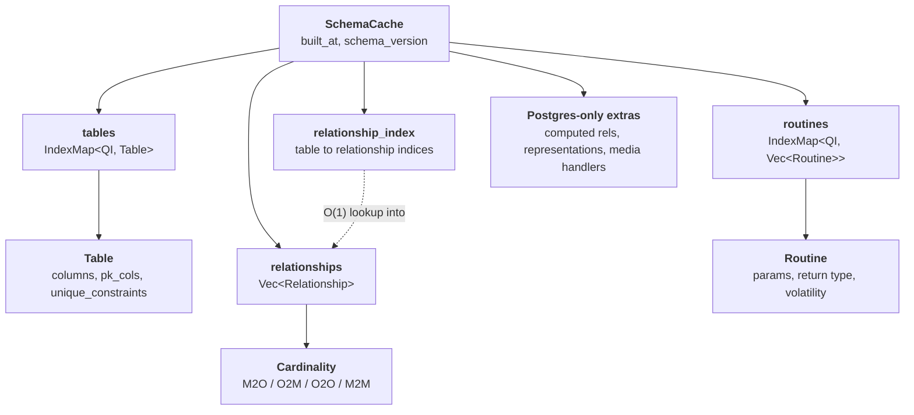
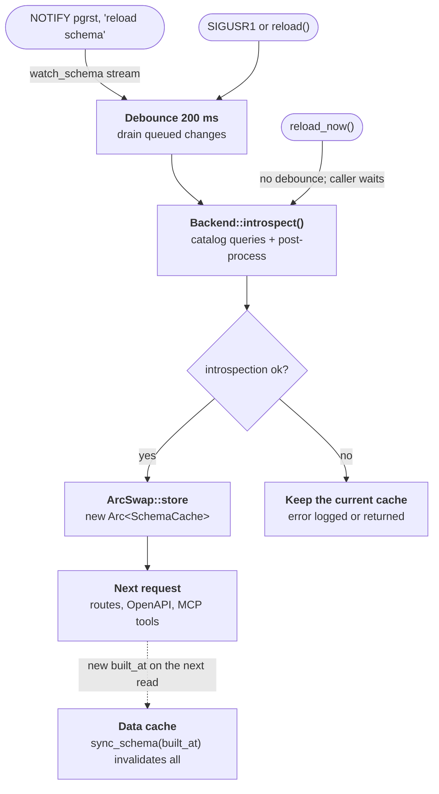

# 05 — Schema Cache and Introspection

**Status: `[Implemented]`** for the cache types and Postgres introspection, with
specific future-only sub-features tagged `[Planned]` inline.

The `SchemaCache` is the single source of truth about the database's exposed
surface. Every surface and the plan layer read from it; nothing below the
adapter layer talks to the database catalog directly.

## Lifecycle

The cache is built once at startup (`Builder::build_components` calls
`Backend::introspect`) and rebuilt whenever a reload is triggered; see
[Hot reload](#hot-reload) below for the sequence. Each build runs the catalog
queries, assembles a `SchemaCache`, post-processes it (M2M and inverse
relationships, FK marking, relationship index) and stamps `built_at`.

The cache is held behind `ArcSwap<SchemaCache>` in the REST `AppState`
([04-surfaces.md](04-surfaces.md)) and in `McpServer`, so a reload swaps it
atomically without rebuilding routes or blocking readers.

## Cache types

Defined in [pgvis-core/src/cache.rs](../crates/pgvis-core/src/cache.rs). All
types use *string* type names (not Postgres OIDs) so they are valid for both
Postgres (`int4`, `jsonb`) and SQLite (`INTEGER`, `TEXT`).

| Type | Purpose | Notes |
| ------ | --------- | ------- |
| `QualifiedIdentifier` | `schema.name` key | SQLite uses `"main"` by convention |
| `SchemaCache` | top-level container | `IndexMap` preserves introspection order → deterministic OpenAPI |
| `Table` | table or view | `is_view`; `insertable`/`updatable`/`deletable` drive which HTTP methods/MCP tools exist |
| `Column` | one column | `typ` (resolved base), `nominal_type` (declared), `nullable`, `default`, `enum_values`, `is_generated`, `updatable`, `is_pk`, `is_fk`, `ordinal` |
| `Relationship` | FK edge | `source/target` tables+columns, `cardinality`, `constraint_name` (disambiguation), `is_self` |
| `Cardinality` | M2O / O2M / O2O / M2M | M2M carries the junction table + its source/target FK columns inline |
| `Routine` | stored function | `params`, `return_type`, `return_type_is_set/_is_composite`, `volatility`, `isolation_level`, hoisted `settings` |
| `UniqueConstraint` | unique/PK constraint | used for upsert `ON CONFLICT` targeting |
| `ComputedRelationship` | function-as-relationship | **`[Planned]` data only** — Postgres-only; populated as a TODO |
| `DataRepresentation` | domain type ↔ json/text cast | **`[Implemented]`** introspection (`query_representations`, Postgres); builder integration is TODO |
| `MediaHandler` | custom `Accept` type → aggregate fn | **`[Planned]` data only** — Postgres-only; TODO |

`SchemaCache` exposes lookup helpers used by the planner: `find_table`,
`find_relationships` (O(1) HashMap lookup via the pre-built `relationship_index`
— direction filtering happens in the planner), and `find_routines` (returns *all*
overloads under a name; the planner picks one by argument names — see
[02-core-pipeline.md](02-core-pipeline.md)).

`Column` and `Table` carry rich metadata specifically so the SQL builder and
OpenAPI generator never need to re-introspect: e.g. `is_generated` excludes a
column from INSERT payloads and marks it `readOnly` in OpenAPI; `pk_cols` /
`unique_constraints` drive `Location` headers and upsert targets;
`enum_values`/`max_len`/`default` become OpenAPI constraints.

## Postgres introspection

Module [pgvis-postgres/src/introspect](../crates/pgvis-postgres/src/introspect/mod.rs).
Entry point `load_schema_cache(client, cfg)`.

It runs all catalog queries inside a transaction with `SET LOCAL search_path =
''` so every name resolves fully-qualified (and `SET LOCAL` actually takes
effect on a pooled connection). The transaction is always ended
(COMMIT on success, ROLLBACK on error), reverting the `search_path`.

Query modules:

| Module | Discovers |
| -------- | ----------- |
| [tables.rs](../crates/pgvis-postgres/src/introspect/tables.rs) | tables, views, columns, PKs, unique constraints |
| [relationships.rs](../crates/pgvis-postgres/src/introspect/relationships.rs) | foreign keys |
| [routines.rs](../crates/pgvis-postgres/src/introspect/routines.rs) | functions, parameters, volatility |
| [representations.rs](../crates/pgvis-postgres/src/introspect/representations.rs) | data representation casts |
| [post_process.rs](../crates/pgvis-postgres/src/introspect/post_process.rs) | derived metadata (below) |

### Post-processing

After the raw queries, four passes run in
[cache_post_process.rs](../crates/pgvis-core/src/cache_post_process.rs):

1. `infer_m2m_relationships` — detect junction tables (a table whose PK columns
   are a superset of its FK columns to two other tables) and synthesize `M2M`
   relationships.
2. `add_inverse_relationships` — for every discovered M2O, add the reverse O2M
   edge so embedding works in both directions.
3. `build_relationship_index` — build a `HashMap<QualifiedIdentifier, Vec<usize>>`
   mapping each table to the indices of its relationships in the `relationships`
   vec. This gives `find_relationships()` O(1) lookup instead of scanning the
   entire relationships list.
4. `mark_fk_columns` — set `Column.is_fk` for columns participating in any FK.

`[Planned]` introspection gaps (the fields exist on the types but are populated
empty today): computed relationships (`allComputedRels`), media handlers,
`schema_version`, and view primary-key dependency tracing. `built_at` is set on
every build; reload consumers use it to notice a new cache. These are enumerated
in [08-future-scope.md](08-future-scope.md).

## Hot reload

`Backend::watch_schema()` ([03-backends-and-dialects.md](03-backends-and-dialects.md))
is the push channel. On Postgres it is `LISTEN pgrst` on a dedicated
connection outside the request pool
([schema_watch.rs](../crates/pgvis-postgres/src/schema_watch.rs)), following
PostgREST: `NOTIFY pgrst, 'reload schema'` (or an empty payload) from a
migration or a DDL event trigger asks every instance to reload; other payloads
are ignored. The listener reconnects with backoff (0.5 s doubling to 30 s) and
reports one change after a reconnect, in case a notification was missed. The
replica backend listens on its primary. SQLite has no push channel.

[`SchemaReloader`](../crates/pgvis-lib/src/reload.rs) (spawned by the
`Builder`, exposed as `Components::reloader`, and usable on its own by
embedders) turns those signals into an atomic swap:

`reload()` returns at once, and requests that arrive together are coalesced
into one introspection; the debounce lets a migration's burst of DDL reload
once. `reload_now()` reloads and waits, e.g. right after running migrations,
and returns the error if introspection fails. The `pgvis` binary calls
`reload()` on `SIGUSR1`. In every case a failed introspection keeps the
current cache, and in-flight requests finish on the snapshot they started
with.

Because surfaces use wildcard routes and read the cache snapshot per request,
no routes, OpenAPI document, or MCP tool list need to be rebuilt structurally —
they reflect the new cache on the next request. The data cache compares
`SchemaCache::built_at` with the one its entries were made against before each
lookup and invalidates every entry when it changed, so no response cached
against the old schema is served.
