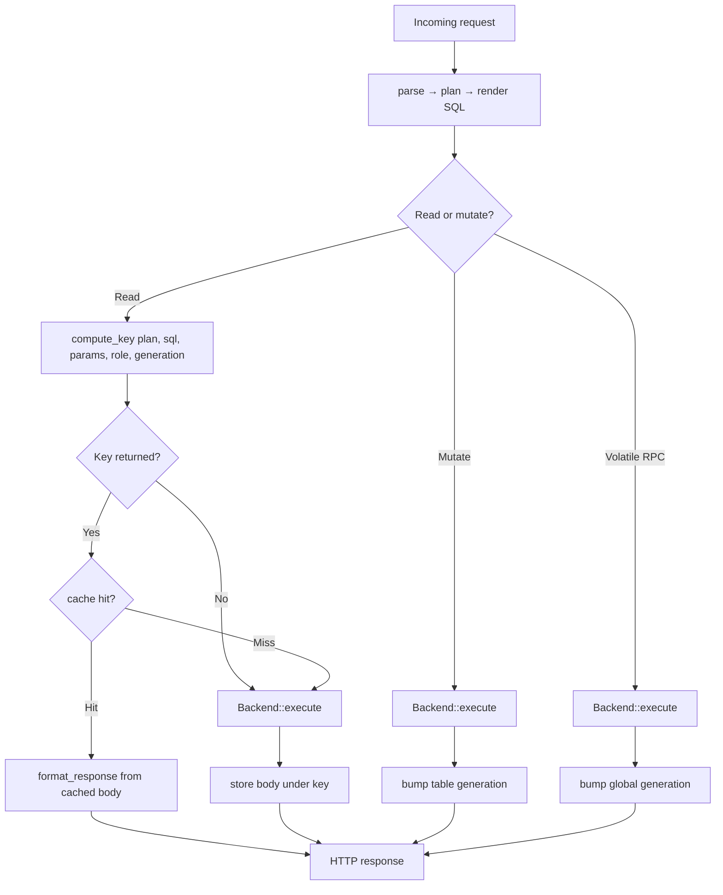

# Data Cache

`[Implemented]` — opt-in; keyed by role + claims + rendered query + table generation; table-scoped invalidation on writes

An optional **in-memory response cache** for read queries. When enabled, a
read whose response is cacheable is stored under a key that hashes the security
context and the rendered query, and subsequent identical reads are served from
memory without touching the backend. A write to a table bumps that table's
generation counter, causing subsequent key computations to produce different keys
— effectively invalidating stale entries without clearing the store.

The cache is **off by default**. It is created inside
[`build_app()`](../crates/pgvis-router/src/routing.rs) only when
`config.cache.enabled == true`, so a disabled cache allocates nothing and adds
no per-request cost beyond a single `Option` check.

- Cache module: [pgvis-router/src/data_cache.rs](../crates/pgvis-router/src/data_cache.rs)
- Dispatch integration: [pgvis-router/src/routing.rs](../crates/pgvis-router/src/routing.rs)
- Config struct: [pgvis-core/src/config.rs](../crates/pgvis-core/src/config.rs) (`CacheConfig`)
- Underlying store: the [`svcache`](https://crates.io/crates/svcache) crate (TTL + LRU over `DashMap`)

## Where it sits in the request lifecycle

The cache is a wrapper around two points in `dispatch_request`: a read-side
lookup before backend execution, and store/invalidate hooks after it. Parsing,
planning, and SQL building all run unchanged — the cache key is computed *from*
the finished `ReadPlan` plus the rendered SQL, so it never alters what would be
executed on a miss.



Source: the read lookup, store, and invalidate blocks are steps 4b / 5b / 5c in
[`dispatch_request`](../crates/pgvis-router/src/routing.rs). The hit path
reconstructs a `QueryResult` from the cached entry and runs it through the same
[`response::format_response`](../crates/pgvis-router/src/response.rs) as a live
result, so singular (`Accept: application/vnd.pgrst.object`), pagination, and
cursor headers are applied identically on hits and misses.

## What gets cached

`compute_key` ([data_cache.rs](../crates/pgvis-router/src/data_cache.rs)) decides
cacheability and returns `Some(key)` or `None`:

| Query shape | Cached? |
| ------------- | --------- |
| PK lookup — every primary-key column filtered with `eq` (non-negated, single value) | Always (when cache enabled) |
| List / collection query | Only when `cache_lists = true` |
| Any query with embeds | Never |
| Mutations (`POST`/`PATCH`/`PUT`/`DELETE`), RPC | Never read-cached |

Embeds are excluded because a join pulls rows from multiple tables; only the
top-level table is tracked.

### Key identity

The PK-vs-list distinction decides *cacheability* only — it is **not** the key.
Every cacheable read gets the same key form:

```text
{role}:{pk|list}:{schema}.{table}:g{generation}:{hash}
```

where `generation` is the current per-table generation counter (incremented on
each write to that table, or the global generation on volatile RPCs — whichever
is higher), and `hash` is a 64-bit FNV-1a hash of, in order:

1. the JWT **claims** (streamed directly from the `serde_json::Value` tree
   without allocating an intermediate String), then
2. the **rendered SQL**, then
3. the **bound parameters** (also streamed from the Value tree).

`role` is the resolved DB role (or `"anon"`) and prefixes the key, so different
roles never collide. Folding claims into the hash means two users sharing a role
but differing in identity (e.g. `sub`) get **distinct** entries — a hit never
serves one user's RLS-filtered rows to another. Folding the rendered SQL +
params in means the same PK requested with a different `select`, an extra
filter, a different order, or different pagination also gets a distinct entry —
the key can never alias two responses of different shape. Including the generation
counter means a write automatically causes subsequent reads to compute a
different key — a cache miss — without needing to scan or clear the store.
(The `pk`/`list` label is purely for readability when inspecting keys.)

### Hashing strategy

The hash uses FNV-1a (`FnvHasher`), a fast non-cryptographic hash suitable for
internal cache keys where adversarial collision resistance is not needed.
The `hash_json_value()` helper walks the JSON value tree recursively, feeding
type-discriminant tags and raw bytes directly into the hasher, avoiding
the allocation that a `claims.to_string()` + `DefaultHasher` approach would
incur on every cacheable read.

## Invalidation model

Invalidation is **generation-based**: writes bump a per-table generation counter
stored in `table_generations: RwLock<HashMap<String, u64>>`. Since the generation
is embedded in every cache key, bumping it causes all subsequent
`compute_key()` calls for that table to produce keys that don't match any
existing stored entry — effectively a cache miss without clearing the store. Old
entries are eventually evicted by LRU pressure or TTL expiry.

Two write paths trigger invalidation, in step 5c of `dispatch_request`
([routing.rs](../crates/pgvis-router/src/routing.rs)):

- **Mutations** (`ActionPlan::Mutate` — INSERT/UPDATE/DELETE) call
  `invalidate_table(target)`, which bumps only that table's generation.
- **Volatile RPC** (`ActionPlan::Call` whose `function_info.volatility ==
  Volatile`) calls `invalidate_all`, which bumps a global generation counter
  (`AtomicU64`). Since `table_generation()` returns
  `max(table_gen, global_gen)`, this effectively invalidates all tables.

This approach avoids the thundering-herd problem of whole-store clearing: a write
to table `T` only invalidates entries for `T`, while entries for unrelated tables
remain hot. For cascading FK writes, the current model is still optimistic (only
the directly-mutated table is invalidated). If a future FK/trigger dependency
graph is added, `invalidate_table` can be extended to bump related tables too.

### Remaining staleness edge

A function that actually modifies data but is mislabeled `STABLE`/`IMMUTABLE` in
the catalog will not trigger invalidation (only `VOLATILE` does). That is a
schema-definition error on the database side; `ttl_seconds` still bounds the
resulting staleness.

## TTL and capacity

Backed by `svcache::SvCache::with_ttl_and_limit(ttl, max_entries)`:

- **TTL** (`ttl_seconds`, default 60) — entries expire lazily on read after the
  duration. A miss on an expired entry re-queries the backend.
- **Capacity** (`max_entries`, default 10000) — when full, least-recently-used
  entries are evicted.

TTL is the backstop for every staleness gap: even when an invalidation is
missed (the mislabeled-volatility edge above), no entry outlives `ttl_seconds`.

## Caveats before enabling

1. **Per-identity RLS is handled by the key, not by the security boundary.**
   Because claims are folded into the key, two users sharing a role get distinct
   entries, so a hit cannot leak one user's rows to another. The flip side is hit
   rate: highly-personalized data (a distinct claims set per request) produces a
   distinct entry per user and benefits little from caching. PK lookups on
   shared, role-gated data are the sweet spot.
2. **`cache_lists` cardinality.** List keys hash the full SQL+params, so every
   distinct filter/order/pagination combination is a separate entry. High-variety
   list traffic yields low hit rates and high memory churn; it is off by default
   for this reason.

## Observability

`GET /pgvis/cache` returns the current settings plus a stats snapshot
(handler: `handle_cache_info` in
[routing.rs](../crates/pgvis-router/src/routing.rs)). The endpoint is always
registered; `stats` is `null` when caching is disabled.

```json
{
  "settings": { "enabled": true, "ttl_seconds": 60, "max_entries": 10000, "cache_lists": false },
  "stats":    { "hits": 1280, "misses": 240, "invalidations": 12, "entries": 305, "hit_rate": 84.21 }
}
```

`entries` is read live from `SvCache::len()`, so it reflects the actual stored
set rather than a running counter; it may briefly include entries that are
expired-but-not-yet-evicted, since svcache expires lazily.
`hits`/`misses`/`hit_rate`/`invalidations` are exact counters.

## Configuration

See [06-errors-and-config.md](06-errors-and-config.md) for the config system as a
whole. The cache is the `[cache]` table / `CacheConfig` struct:

| Field | Env | Default | Meaning |
| ------- | ----- | --------- | --------- |
| `cache.enabled` | `PGVIS_CACHE_ENABLED` | `false` | Master switch. Nothing is allocated when off. |
| `cache.ttl_seconds` | `PGVIS_CACHE_TTL` | `60` | Entry lifetime before expiry. |
| `cache.max_entries` | `PGVIS_CACHE_MAX_ENTRIES` | `10000` | LRU capacity. |
| `cache.cache_lists` | `PGVIS_CACHE_LISTS` | `false` | Cache list queries, not just PK lookups. |

CLI flags on `pgvis serve` (`--cache-enabled`, `--cache-ttl`,
`--cache-max-entries`, `--cache-lists`) override the loaded config
([pgvis-server/src/main.rs](../crates/pgvis-server/src/main.rs)).
