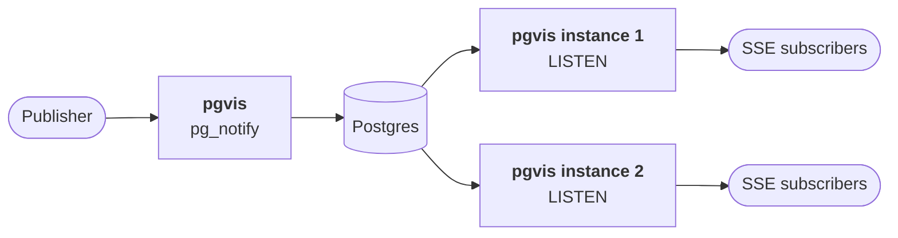
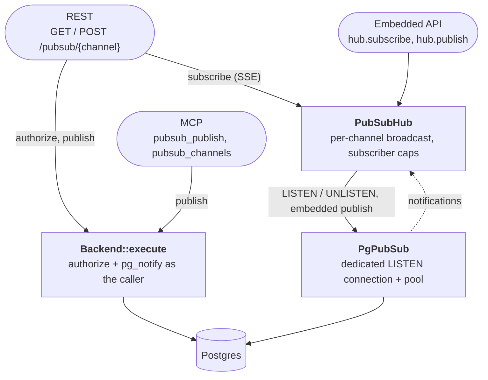
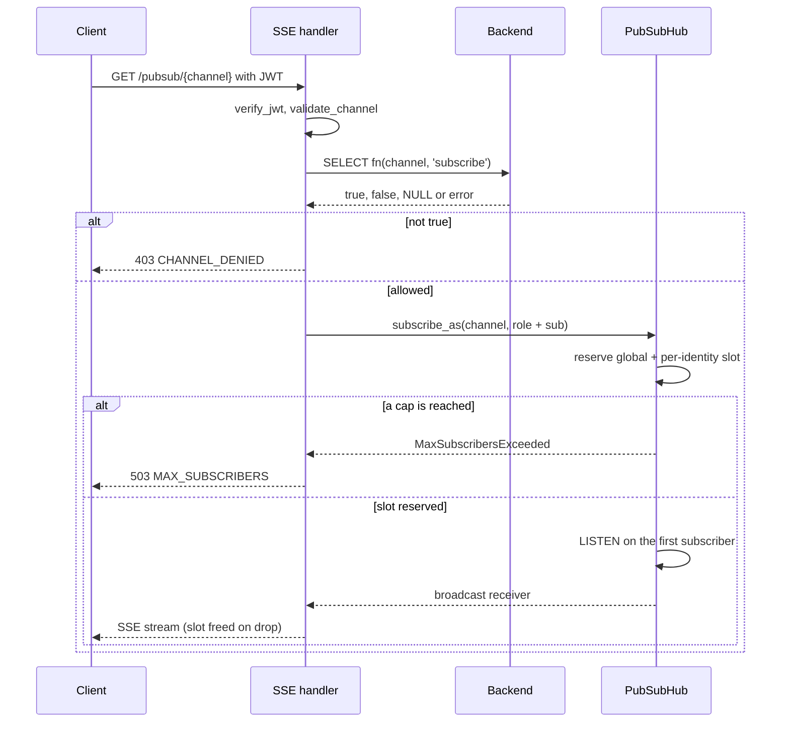

# 10 — Pub/Sub: General-Purpose Messaging via Postgres LISTEN/NOTIFY

## Overview

pgvis exposes a **Redis-style pub/sub** messaging bus backed by Postgres `LISTEN/NOTIFY`. Multiple pgvis instances on the same database form a shared message bus automatically — Postgres itself is the broker.

This is **not** related to database mutations or change-data-capture. It is an independent, general-purpose messaging primitive.

## Architecture

A publish on any instance becomes a Postgres `NOTIFY`; every instance with a
subscriber on that channel holds a `LISTEN` and fans the message out locally.



### In-process layers

Subscriptions go through the `PubSubHub`, which owns the `LISTEN` state; REST
and MCP publishes go straight to the database as the caller, through
`Backend::execute`.



## Design Principles

| Principle | Implementation |
|-----------|---------------|
| Caller-scoped access | REST/MCP publishes and the optional `authorize_function` run through `Backend::execute` as the caller's role, with JWT claims set |
| Single dedicated connection | LISTEN state is per-session; pooled connections would lose subscriptions on recycle |
| Dynamic channel tracking | LISTEN issued on first subscriber, UNLISTEN on last leaving |
| Channel namespacing | All channels prefixed (default `pgvis:`) to avoid collision with application LISTEN/NOTIFY |
| 8 KB payload limit | Validated at publish time before hitting the database |
| Cross-instance | All instances on the same DB auto-share messages via Postgres |
| Exponential backoff | Listener reconnects with `base * 2^attempt` (capped), with jitter |

## Core Types (`pgvis-core/src/pubsub.rs`)

| Type | Role |
|------|------|
| `PubSubMessage` | Channel + payload + timestamp |
| `PubSubConfig` | Enabled, prefix, limits, `authorize_function`, reconnect params |
| `authorize()` / `publish()` | Caller-scoped check and NOTIFY, run through `Backend::execute` |
| `PubSubBackend` trait | Object-safe async trait: listen, unlisten, publish, notification_stream |
| `PubSubStream` | `Pin<Box<dyn Stream<Item = PubSubMessage> + Send>>` |
| `PubSubErrorCode` | PayloadTooLarge, ChannelDenied, InvalidChannel, MaxSubscribersExceeded, NotAvailable, ConnectionLost |

## Postgres Implementation (`pgvis-postgres/src/pubsub.rs`)

`PgPubSub` spawns a background task (`listener_task`) that:

1. Connects to Postgres with a **non-pooled** connection
2. Re-issues LISTEN for all active channels after reconnection
3. Drives `Connection::poll_message()` in a `tokio::select!` loop
4. Forwards `AsyncMessage::Notification` into a `broadcast::Sender`
5. Processes `PubSubCmd` (Listen/Unlisten/Shutdown) from the hub

`PgPubSub::publish` uses a **pooled** connection (`SELECT pg_notify($1, $2)`) as
the DSN's role; only the embedded `hub.publish` takes that path. REST and MCP
publish through `pgvis_core::pubsub::publish`, which runs `pg_notify` via
`Backend::execute` under the caller's role (see
[Authorization](#authorization)).

## Hub (`pgvis-router/src/pubsub.rs`)

`PubSubHub` is the in-process coordinator:

- Holds `HashMap<String, ChannelState>` mapping channel → broadcast sender + subscriber count
- `subscribe_as(channel, identity)` → validates, reserves a global slot and a
  per-identity slot atomically, issues LISTEN on the first subscriber
- `unsubscribe_as(channel, identity)` → releases both slots, issues UNLISTEN on
  the last subscriber (the SSE stream calls it when dropped)
- `subscribe` / `unsubscribe` → the same with no identity (embedded use)
- `publish(channel, payload)` → validates, delegates to `PgPubSub::publish`
- Capped at `max_subscribers` in total and `max_subscribers_per_identity` per
  identity

## Authorization

Every REST pub/sub request verifies the JWT exactly as the data API does
(`verify_jwt`) and builds the same `ExecContext`, marked as a write so it
never runs on a read replica. The identity used for the per-identity cap is
the role plus the `sub` claim; callers without `sub` (anonymous clients) can't
be told apart, so only `max_subscribers` bounds them.

When `pubsub.authorize_function` is set, the database decides per channel:
`SELECT fn(channel text, op text)` runs as the caller, with `op` either
`'subscribe'` or `'publish'`. Anything but `true` (false, NULL, or an error)
is 403 `PGVIS_PUBSUB_CHANNEL_DENIED`. A publish runs the check and the NOTIFY
in one statement (`CASE WHEN fn($3, 'publish') IS TRUE THEN pg_notify(...)
END`), so a denied caller never notifies. Without the function, any caller that
passes JWT verification may use every channel in `allowed_channels`, and
publishes still run as the caller's role.



## Surfaces

### REST

| Endpoint | Method | Description |
|----------|--------|-------------|
| `/pubsub` | GET | Status: active channels, subscriber counts |
| `/pubsub/{channel}` | GET | SSE stream (subscribe). Sends `data: {...}\n\n` events and `: keepalive` comments |
| `/pubsub/{channel}` | POST | Publish: body is the payload string. Returns `{"ok": true}` |

The router is nested at `/pubsub` at the server root (outside the API
prefix). All three endpoints authenticate like the data API.

SSE format:
```
data: {"channel":"orders.new","payload":"{\"id\":42}","timestamp":"2025-06-01T12:00:00Z"}

: keepalive
```

### MCP

| Tool | Description |
|------|-------------|
| `pubsub_publish` | Publish a message (channel + payload args) |
| `pubsub_channels` | List active channels on this instance |

MCP does not support persistent subscriptions (no streaming). Clients use REST SSE for subscriptions.
The tools are listed only when pub/sub is enabled and a pub/sub backend is
attached (`McpServer::with_pubsub`, done for MCP over HTTP by
`Builder::with_mcp_http`); `pubsub_publish` runs as `anon_role` through the
same authorize path as REST, and is refused on a `read_only` server.

### Embedded Rust

```rust
let hub: Arc<PubSubHub> = components.pubsub.unwrap();

// Publish
hub.publish("orders.new", r#"{"id": 42}"#).await?;

// Subscribe
let mut rx = hub.subscribe("orders.new").await?;
while let Ok(msg) = rx.recv().await {
    println!("{}: {}", msg.channel, msg.payload);
}
```

## Configuration

```toml
[pubsub]
enabled = true                    # Master switch (default: false)
channel_prefix = "pgvis:"        # Postgres channel prefix
max_payload_bytes = 7500          # Pre-validation (Postgres limit ~8000)
max_subscribers = 1000            # Global cap across all channels
max_subscribers_per_identity = 100  # Per role + `sub` claim (0 = off)
channel_buffer_size = 64          # Per-channel broadcast buffer
allowed_channels = ["orders.*"]   # Glob allowlist (empty = all)
authorize_function = "api.can_use_channel"  # Optional: fn(channel, op) -> bool
reconnect_base_ms = 500           # Exponential backoff base
reconnect_max_ms = 30000          # Backoff cap
keepalive_interval_secs = 15      # SSE keepalive comment interval
```

Environment variables: any key as `PGVIS_PUBSUB__<KEY>` (e.g.
`PGVIS_PUBSUB__ENABLED`, `PGVIS_PUBSUB__AUTHORIZE_FUNCTION`).

CLI flags on `pgvis serve`: `--pubsub-enabled`, `--pubsub-channel-prefix`
(also read from `PGVIS_PUBSUB_ENABLED` / `PGVIS_PUBSUB_CHANNEL_PREFIX`).

## Error Codes

| Code | HTTP | Meaning |
|------|------|---------|
| `PGVIS_PUBSUB_PAYLOAD_TOO_LARGE` | 400 | Payload exceeds max_payload_bytes |
| `PGVIS_PUBSUB_CHANNEL_DENIED` | 403 | Channel not in `allowed_channels`, or refused by `authorize_function` |
| `PGVIS_PUBSUB_INVALID_CHANNEL` | 400 | Empty name, null bytes, or prefix + name over 63 bytes |
| `PGVIS_PUBSUB_MAX_SUBSCRIBERS` | 503 | Global or per-identity subscriber cap reached |
| `PGVIS_PUBSUB_NOT_AVAILABLE` | 501 | Disabled or unsupported backend |
| `PGVIS_PUBSUB_CONNECTION_LOST` | 503 | Listener connection down |

## Limitations

- **8 KB payload** — Postgres NOTIFY hard limit. For larger messages, publish a pointer/URL.
- **No persistence** — messages are fire-and-forget. Disconnected subscribers miss messages.
- **No acknowledgement** — subscribers don't ACK; at-most-once delivery.
- **SQLite not supported** — pub/sub requires Postgres LISTEN/NOTIFY.
- **Subscriber lag** — slow consumers miss messages (broadcast buffer overflow). A `: lagged N messages` SSE comment is sent.

## File Map

| File | Role |
|------|------|
| `crates/pgvis-core/src/pubsub.rs` | Types, trait, config, validation |
| `crates/pgvis-core/src/error.rs` | `Error::PubSub` variant |
| `crates/pgvis-core/src/config.rs` | `Config.pubsub` field |
| `crates/pgvis-postgres/src/pubsub.rs` | `PgPubSub` implementation |
| `crates/pgvis-router/src/pubsub.rs` | `PubSubHub`, REST handlers, SSE |
| `crates/pgvis-mcp/src/server.rs` | MCP `pubsub_publish`/`pubsub_channels` tools |
| `crates/pgvis-lib/src/lib.rs` | Wiring: creates hub, mounts router |
| `crates/pgvis-server/src/main.rs` | CLI flags: `--pubsub-enabled`, `--pubsub-channel-prefix` |
