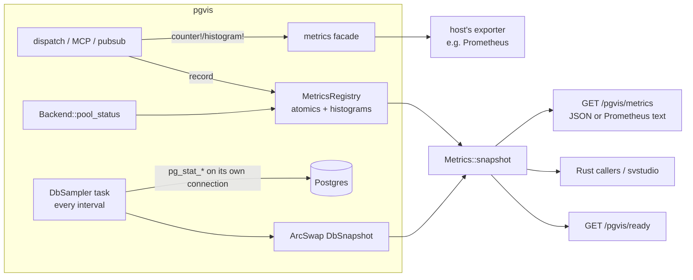

# Metrics and Health

`[Proposed]` — design and phased plan; nothing here is implemented yet beyond
`Backend::pool_status()` and the `pool` field of `GET /pgvis/cache`.

pgvis sits between every caller and the database, so it is the natural place to
answer two questions an operator or an embedding application keeps asking:
**is pgvis healthy and how is it performing**, and **is the database healthy**.
This document designs one metrics layer that serves both, for the two ways pgvis
is used: embedded as a library (the host owns HTTP, auth and its own metrics
exporter) and as the standalone `pgvis` binary.

## Goals

- Integrators get pgvis's own numbers (requests, latency, pool, cache, replicas,
  pub/sub) and the database's vital signs through **one typed Rust API** and
  **one HTTP endpoint**, with Prometheus naming.
- A host that already exports metrics (svstudio installs
  `metrics-exporter-prometheus`) gets pgvis's metrics **with zero glue**.
- Liveness and readiness endpoints a load balancer or Kubernetes can use.
- Bounded, predictable cost: nothing when disabled, a fixed small load when on.
- Safe by default: no query text, no row data, no per-table labels unless
  opted in, endpoints gated like the data API.

## Non-goals

- Not a general Postgres monitoring product (pganalyze, pgwatch). pgvis
  exposes the handful of signals that tell you the database is in trouble or
  that pgvis is the bottleneck; deep analysis stays with dedicated tools.
- No log shipping, no tracing backend. (Spans via `tracing` are a separate
  concern; the request spans below are compatible with OpenTelemetry layers.)

## Two kinds of data, two mechanisms

| | pgvis metrics | Database metrics |
|---|---|---|
| What | events pgvis itself sees: requests, errors, pool checkouts, cache hits | state only Postgres knows: connections, locks, cache hit ratio, XID age, replication |
| How collected | **pushed** at the event site, in-process, O(1) | **sampled** by a background task querying `pg_stat_*` views |
| Cost | an atomic increment / histogram record per event | a few cheap catalog queries every *interval* on a dedicated connection |
| Freshness | live | as of the last sample (`sampled_at` is reported) |
| Needs DB privileges | no | `pg_monitor` (or `pg_read_all_stats`) for the full set |

Keeping them separate is what makes the cost bounded: request handling never
waits on a metrics query, and the database is queried at a fixed rate
regardless of traffic.

## Architecture



1. **Event sites** call the [`metrics`](https://docs.rs/metrics) crate macros
   (`counter!`, `gauge!`, `histogram!`). It is a facade: with no recorder
   installed they are no-ops, and pgvis-the-library never installs one. A host
   that installs a recorder (svstudio already does) receives every pgvis metric
   under the `pgvis_` prefix. The standalone binary installs the Prometheus
   recorder itself.
2. The same event sites also update a small **`MetricsRegistry`** owned by
   `AppState` (atomics and fixed-bucket histograms). This backs the pull API, so
   integrators that don't run an exporter still get numbers, and so
   `/pgvis/metrics` works without depending on the host's recorder.
3. A **`DbSampler`** background task (Postgres backends only) runs a fixed set
   of catalog queries every `metrics.db.interval_ms` on its own one-connection
   pool, the same isolation the replica health monitor uses, so a saturated
   request pool never stalls it and it never takes a request connection. The
   result is stored as an immutable `DbSnapshot` behind an `ArcSwap`: readers
   never block and never trigger a query.

## Metric catalog: pgvis

Names follow Prometheus conventions (`_total` counters, `_seconds` durations).
Labels are low-cardinality by construction: `surface` (`rest`/`mcp`/`rpc_inproc`),
`op` (`read`/`insert`/`update`/`delete`/`rpc`), `status` class (`2xx`/`4xx`/`5xx`),
`code` (PGRST code). **No table, schema or role labels by default**
(`metrics.per_target_labels = true` opts in, capped by `max_label_values`).

| Metric | Type | Labels | Source |
|---|---|---|---|
| `pgvis_requests_total` | counter | surface, op, status | `dispatch_request`, MCP `handle_tool_call`, `call_rpc`/`call_read` |
| `pgvis_request_duration_seconds` | histogram | surface, op | same; wall time end to end |
| `pgvis_request_db_seconds` | histogram | op | executor: pipelined flight + COMMIT |
| `pgvis_request_rows` | histogram | op | `QueryResult.page_total` |
| `pgvis_response_bytes` | histogram | op | `json_bytes()` length |
| `pgvis_errors_total` | counter | code | `format_error` (PGRST/SQLSTATE class) |
| `pgvis_auth_failures_total` | counter | reason (`missing`,`invalid`,`expired`,`no_role`) | `verify_jwt` |
| `pgvis_pool_connections` | gauge | state (`open`,`idle`,`max`) | `Backend::pool_status()` at scrape |
| `pgvis_pool_waiting` | gauge | — | `pool_status().waiting` |
| `pgvis_pool_checkout_seconds` | histogram | — | `Checkout::get` |
| `pgvis_pool_checkout_failures_total` | counter | reason (`timeout`,`unreachable`) | `pool_error` |
| `pgvis_pool_connections_discarded_total` | counter | — | `Checkout` drop guard (request cancelled mid-transaction) |
| `pgvis_cache_requests_total` | counter | result (`hit`,`miss`) | `DataCache::get` |
| `pgvis_cache_entries` | gauge | — | `DataCache::stats` |
| `pgvis_cache_invalidations_total` | counter | scope (`table`,`all`) | `invalidate_*` |
| `pgvis_schema_cache_reloads_total` | counter | result | schema reload (when implemented) |
| `pgvis_schema_cache_age_seconds` | gauge | — | time since last successful introspection |
| `pgvis_replica_eligible` | gauge | — | `PgReplicaBackend::eligible_readers()` |
| `pgvis_replica_lag_bytes` | gauge | replica index | health monitor |
| `pgvis_pubsub_subscribers` | gauge | — | hub counters |
| `pgvis_pubsub_messages_total` | counter | direction (`in`,`out`), result | hub / dispatch loop |
| `pgvis_pubsub_lagged_total` | counter | — | broadcast `Lagged` |
| `pgvis_build_info` | gauge (=1) | version, backend, pg_version | startup |

## Metric catalog: database

Sampled per interval from one database (the one pgvis is connected to), plus
the primary/replica topology pgvis knows about. pgvis's floor is PostgreSQL 17,
so every PG17 view is available; PG18 additions are gated on
`server_version_num` (already read at introspection).

| Area | Metric(s) | Source | Min | Why it matters |
|---|---|---|---|---|
| Server | `pgvis_db_up`, uptime, `server_version_num`, `max_connections` | `pg_postmaster_start_time()`, `pg_settings` | 17 | basic reachability and capacity |
| Connections | backends by state (`active`, `idle`, `idle in transaction`, `idle in transaction (aborted)`), % of `max_connections` | `pg_stat_activity` | 17 | connection exhaustion is the #1 outage cause for API layers |
| Long work | oldest active query age, oldest open transaction age, oldest `idle in transaction` age | `pg_stat_activity` | 17 | long transactions block vacuum and hold locks |
| Locks | waiting backends, blocked-by count, deadlocks (rate) | `pg_stat_activity.wait_event_type = 'Lock'`, `pg_blocking_pids()`, `pg_stat_database.deadlocks` | 17 | lock pile-ups present as API latency |
| Throughput | commits, rollbacks, rows returned/fetched/inserted/updated/deleted (rates) | `pg_stat_database` | 17 | rollback ratio flags app errors |
| Cache | buffer cache hit ratio (`blks_hit / (blks_hit + blks_read)`) | `pg_stat_database` | 17 | working set no longer fits in memory |
| Temp spill | temp files and bytes (rates) | `pg_stat_database` | 17 | sorts/hashes spilling: missing `work_mem` or indexes |
| Sessions | sessions abandoned / fatal / killed | `pg_stat_database` | 17 | clients dropping connections (pool misconfiguration) |
| Wraparound | `age(datfrozenxid)`, `mxid_age(datminmxid)` as % of 2^31 | `pg_database` | 17 | transaction ID wraparound is a hard outage |
| Size | database size | `pg_database_size(current_database())` | 17 | growth and disk planning |
| Vacuum health | tables with dead-tuple ratio over threshold, oldest autovacuum | `pg_stat_user_tables` (aggregated; per-table only when opted in) | 17 | bloat and stale statistics |
| WAL / checkpoints | WAL bytes generated (rate), requested vs timed checkpoints, checkpoint write time | `pg_stat_wal`, `pg_stat_checkpointer` | 17 | write pressure; forced checkpoints mean `max_wal_size` is too small |
| I/O | reads/writes/extends and time by backend type and context | `pg_stat_io` (PG18 adds `read_bytes`/`write_bytes`/`extend_bytes` and WAL rows) | 17 / 18 | where I/O time goes |
| Replication (primary) | per standby write/flush/replay lag | `pg_stat_replication` | 17 | stale reads from replicas |
| Replication slots | retained WAL bytes per slot, inactive slots | `pg_replication_slots` | 17 | an abandoned slot fills the disk |
| Replication (replica) | replay delay (`now() - pg_last_xact_replay_timestamp()`) | function | 17 | read freshness on the node pgvis reads from |
| Top statements (opt-in) | top-N by total time: calls, mean/total time, rows, shared blks hit/read; **queryid and normalized text only** | `pg_stat_statements` | extension | which pgvis queries cost the most |
| Async I/O (opt-in) | in-flight AIO operations | `pg_aios` | 18 | PG18 AIO saturation |

All sampler queries are fixed SQL (no user input), run with
`SET LOCAL statement_timeout` (default 2 s) and `SET LOCAL lock_timeout`, return
aggregates (bounded row counts), and are skipped individually when a view is
missing or unreadable. Each failure is reported in the snapshot (`errors[]`)
instead of failing the whole sample. Rates are computed by pgvis from the delta
between two samples, so integrators don't have to.

## API surface

### Rust (library integrators)

```rust
// pgvis-lib: Components gains a metrics handle; AppState exposes the same.
let components = pgvis_lib::Builder::new(dsn).config(cfg).build_components().await?;
let m: Arc<pgvis_router::Metrics> = components.metrics.clone();

let snap: MetricsSnapshot = m.snapshot();        // cheap: atomics + ArcSwap load
snap.pgvis.requests.by_status["5xx"];             // typed, serde::Serialize
snap.pgvis.pool;                                  // PoolStatus (exists today)
snap.db.as_ref().map(|db| db.connections.idle_in_transaction);
snap.db_sampled_at;                               // freshness
m.readiness();                                    // Ready | NotReady(reasons)
```

- `MetricsSnapshot` / `DbSnapshot` are plain `#[derive(Serialize)]` structs in
  `pgvis-core`, so they can be returned from the host's own endpoints, logged,
  or forwarded to MCP without pgvis knowing about the host.
- `metrics` facade emission is automatic and needs nothing from the host
  beyond installing a recorder (or not).
- `Backend` gains one optional method, `fn db_sampler(&self) -> Option<…>`
  (default `None`; SQLite returns a small subset or `None`), keeping the core
  backend-agnostic, exactly as `pool_status()` does today.

### HTTP

| Route | Purpose | Auth |
|---|---|---|
| `GET /pgvis/metrics` | `MetricsSnapshot` as JSON | `metrics.auth` (below) |
| `GET /pgvis/metrics` with `Accept: text/plain; version=0.0.4` | Prometheus text, rendered from the registry (no external exporter needed) | same |
| `GET /pgvis/health` | liveness: process up, 200 always | none |
| `GET /pgvis/ready` | readiness: schema cache loaded, DB reachable within timeout, pool not saturated for > N s, ≥ 1 eligible reader or primary fallback; 503 with reasons otherwise | none (no details beyond reason codes) |

`/pgvis/cache` keeps working and becomes a subset of `/pgvis/metrics`.
Embedders mount none of these unless they call `build_router`; a host with its
own `/metrics` uses the Rust API or the facade instead.

### MCP (optional)

A read-only resource `pgvis://metrics` returning the JSON snapshot, so an
operator agent can ask "is the database healthy?" (behind the same auth guard
as the other MCP tools; off unless `metrics.mcp_resource = true`).

## Configuration

```toml
[metrics]
enabled = true                 # registry + facade emission; near-zero cost
auth = "jwt"                   # "jwt" (data-API auth + metrics_role claim) | "none" | "token"
metrics_role = "pgvis_metrics" # JWT role (or claim) allowed to read /pgvis/metrics
per_target_labels = false      # table/function labels (cardinality!)
max_label_values = 100

[metrics.db]
enabled = true                 # DbSampler (Postgres only)
interval_ms = 15000
statement_timeout_ms = 2000
statements_top_n = 0           # >0 enables pg_stat_statements top-N (normalized text only)
per_table = false              # pg_stat_user_tables per-table rows
```

Defaults: registry on (it is just atomics), DB sampler on at 15 s, everything
with text or per-object detail off.

## Security model

- **Exposure:** the JSON/Prometheus endpoint reveals operational detail
  (connection counts, sizes, slow-statement shapes). It is gated by
  `metrics.auth`; default `jwt` requires a valid token whose role equals
  `metrics_role` (anonymous callers get 401 even when `anon_role` is set). The
  standalone binary may instead serve metrics on a separate loopback-only
  `--metrics-bind`.
- **Collection privileges:** the sampler runs as the DSN role on its own
  connection, never as the caller. Full coverage needs `pg_monitor`; without
  it, Postgres returns `<insufficient privilege>` or NULLs for other sessions,
  which the snapshot reports as `null` plus a hint, never as an error.
- **No data leakage:** no parameter values, row data or JWT claims are ever
  recorded; `pg_stat_statements` is limited to `queryid` plus normalized text,
  and is opt-in.
- **Cardinality as a DoS vector:** labels come from fixed enums; opt-in
  per-target labels are capped, and overflow folds into `other`.

## Cost budget

- Hot path: ≤ 4 atomic ops + 2 histogram records per request (no allocation,
  no locks); measured target < 1% overhead at the current ~28k rps benchmark.
- DB: ~8 short catalog queries per interval on one connection (≈ 0.5 ms each
  on an idle server); one connection held only for the duration of a sample.
- Memory: fixed (histograms are fixed-bucket; snapshot is a few KB).

## Plan

| Phase | Scope | Effort (est.) | Acceptance |
|---|---|---|---|
| **P1: pgvis metrics** | `MetricsRegistry` + facade emission at request, pool (`Checkout`), cache, auth, replica and pub/sub sites; `Metrics::snapshot()`; `GET /pgvis/metrics` JSON + Prometheus text; `metrics.auth`; fold `/pgvis/cache` into it | 2–3 days | unit tests per counter; svstudio receives `pgvis_*` series with no code change once it bumps pgvis; benchmark shows < 1% throughput loss |
| **P2: health** | `/pgvis/health`, `/pgvis/ready` with reason codes; `Metrics::readiness()`; schema-cache age | 1 day | readiness flips on DB down, pool saturation, no eligible readers (integration tests with a killed/saturated backend) |
| **P3: DB sampler (core)** | `DbSampler` on its own pool; server, connections, long work, locks, throughput, cache ratio, temp, sessions, wraparound, size, WAL/checkpointer, replication + slots; delta-based rates; per-query error isolation; `pg_monitor` handling | 3–4 days | integration tests on PG17 and PG18; works (degraded) without `pg_monitor`; sample time bounded by `statement_timeout` |
| **P4: opt-in depth** | `pg_stat_statements` top-N, per-table vacuum stats, `pg_stat_io` (PG18 byte columns), `pg_aios`, MCP resource | 2 days | gated tests skip when the extension/version is missing |
| **P5: docs + svstudio** | arch doc to `[Implemented]`; README section; svstudio: grant `pg_monitor` to the svapi role, add dashboards/alerts for the critical set (connections %, oldest xact, XID age %, replication lag, slot retention, 5xx rate, pool waiting) | 1 day | dashboards render from beta |

P1 and P2 need no database privileges and can ship first; P3 depends on the
`pg_monitor` decision.

## Open decisions

1. **Facade vs. own exporter.** Proposed: emit through the `metrics` facade
   (svstudio's stack) *and* keep an internal registry for the pull API. The
   alternative, OpenTelemetry metrics, would suit OTel-native hosts but adds a
   heavier dependency; the facade has an OTel bridge if needed later.
2. **Default auth for `/pgvis/metrics`.** Proposed `jwt` + `metrics_role`.
   Alternative: loopback-only listener by default in the binary.
3. **Grant `pg_monitor` to pgvis's DSN role** in svstudio deployments (needed
   for P3's full coverage; read-only, no data access).
4. **Per-target labels** (table/function) default off: confirm, since some
   teams want per-endpoint latency and accept the cardinality.
