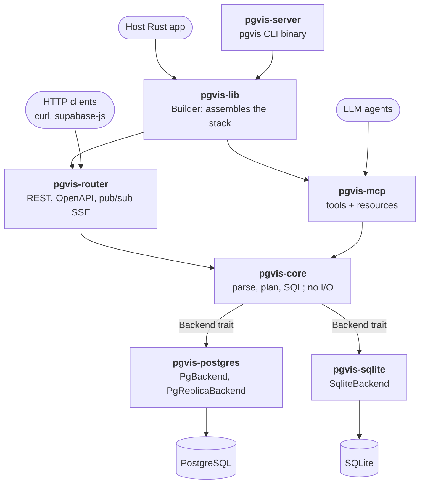
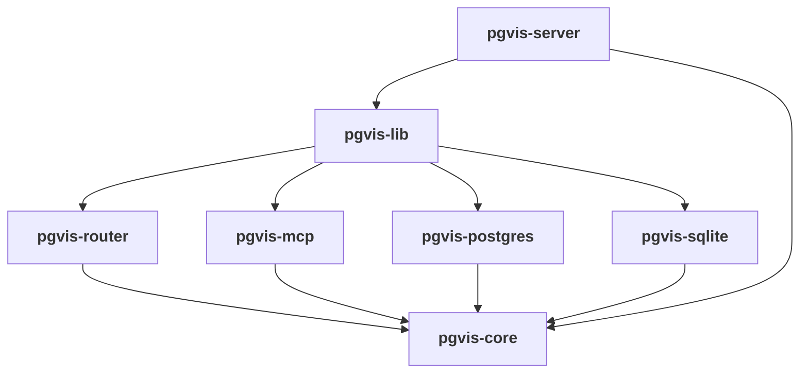

# pgvis Architecture

`pgvis` turns a relational database into a typed API surface. Point it at a
Postgres or SQLite database and it introspects the schema, then serves that
schema three ways from one engine: a **PostgREST-compatible REST API**, an
**OpenAPI 3.0 document**, and an **MCP (Model Context Protocol) tool server** for
LLM agents. It is a Rust workspace designed to be embedded as a library or run as
a standalone binary.

This `arch/` directory is the authoritative architecture reference for the
project. It is self-contained — every document here stands on its own and links
only to source code.

## What pgvis is, and how it differs from PostgREST

pgvis follows PostgREST's request model closely (same query DSL, same `Prefer`
semantics, same `PGRST*` error codes) so existing PostgREST clients work
unchanged. It differs in three structural ways:

- **Backend-agnostic core.** All parsing, planning, and SQL building live in
  an I/O-free crate. Database drivers implement a single
  `Backend` trait. PostgREST hardcodes Postgres throughout.
- **Multi-surface from one pipeline.** REST and MCP both lower their input into
  one `ApiRequest`, run the same planner, and render through the same SQL
  builder. The OpenAPI document is generated from the same `SchemaCache`.
- **Schema in the URL.** Routes are `/{prefix}/{schema}/{table}` by default
  (bookmarkable, proxy-safe), with a PostgREST-compatible header/flat mode for
  drop-in replacement.

## System context

Every caller enters through a thin surface crate; all of them share the I/O-free
core, which reaches a database only through the `Backend` trait.

## Crate topology

Seven crates. Every arrow means "depends on"; all of them point inward to
`pgvis-core`, which has no runtime I/O dependency (no database driver, no HTTP
framework).

| Crate | Role | Key entry points |
| ------- | ------ | ------------------ |
| [pgvis-core](../crates/pgvis-core) | I/O-free engine: parser, plan layer, SQL builder, schema cache, `Backend`/`Dialect`/`Error`/`Config` | [lib.rs](../crates/pgvis-core/src/lib.rs) |
| [pgvis-postgres](../crates/pgvis-postgres) | `Backend` impl for Postgres: pool, introspection, pipelined execution, read replicas, `LISTEN pgrst`, pub/sub | [lib.rs](../crates/pgvis-postgres/src/lib.rs) |
| [pgvis-sqlite](../crates/pgvis-sqlite) | `Backend` impl for SQLite (`rusqlite`): introspection, execution with Rust-side JSON assembly | [lib.rs](../crates/pgvis-sqlite/src/lib.rs) |
| [pgvis-router](../crates/pgvis-router) | axum router, OpenAPI generator, data cache, pub/sub hub + SSE | [routing.rs](../crates/pgvis-router/src/routing.rs) |
| [pgvis-mcp](../crates/pgvis-mcp) | MCP tools/resources from the same cache (stdio + Streamable HTTP) | [tools.rs](../crates/pgvis-mcp/src/tools.rs) |
| [pgvis-lib](../crates/pgvis-lib) | One-liner `Builder` facade for host apps; `SchemaReloader` | [lib.rs](../crates/pgvis-lib/src/lib.rs) |
| [pgvis-server](../crates/pgvis-server) | `pgvis` CLI binary (`serve`/`mcp`/`openapi`/`inspect`) | [main.rs](../crates/pgvis-server/src/main.rs) |

## Status legend

Each subsystem section in these docs carries one of:

- **`[Implemented]`** — built and unit-tested in the codebase today.
- **`[In progress]`** — scaffolded and wired, with TODO seams.
- **`[Planned]`** — designed here, not yet in code.
- **`[Proposed]`** — a design under discussion, not yet accepted or built.

## Status at a glance

| Subsystem | Status | Notes |
| ----------- | -------- | ------- |
| Query-string parser (`query_params`) | `[Implemented]` | winnow parsers for select/filter/order/logic |
| Plan layer (`plan`) | `[Implemented]` | `ApiRequest` → `ActionPlan`; RPC overloads resolved by argument names (`PGRST202`/`PGRST203`) |
| SQL builder (`query`) | `[Implemented]` | CTE-wrapped, dialect-aware; direct and M2M embedding; computed-relationship embedding is still a placeholder |
| Schema cache + Postgres introspection | `[Implemented]` | typed prepared-statement introspection; computed rels / media handlers / view PKs are TODO |
| Schema reload | `[Implemented]` | `LISTEN pgrst`, `SchemaReloader::reload()` / `reload_now()`, `SIGUSR1`; atomic `ArcSwap` swap. See [05-schema-cache.md](05-schema-cache.md) |
| `Backend` trait + `Dialect` | `[Implemented]` | Postgres and SQLite impls; `POSTGRES` and `SQLITE` dialect constants |
| Postgres query execution | `[Implemented]` | one pipelined flight (BEGIN, batched `set_config`, pre-request, query) then COMMIT/ROLLBACK; mutation guards checked before COMMIT; text-protocol params |
| Read replicas | `[Implemented]` | `PgReplicaBackend`: lag-aware round-robin reads, isolated health probes, writes and volatile RPC on the primary |
| SQLite backend | `[Implemented]` | `pgvis-sqlite`: one writer + reader connections (WAL), Rust-side JSON assembly, no schema watch |
| REST routing | `[Implemented]` | routes + planning + `Backend::execute`; JWT verification, `and`/`or` logic filters, cursor pagination; integration-tested against Postgres |
| `pgvis-server` binary | `[Implemented]` | `serve` / `mcp` / `openapi` / `inspect` through `pgvis-lib`; figment layering (defaults → TOML → `PGVIS_*` env → CLI flags), strict config file |
| OpenAPI generation | `[In progress]` | paths/operations emitted; schemas/parameters minimal |
| MCP tools/resources | `[Implemented]` | stdio and Streamable HTTP; tool calls execute end-to-end through the backend as `anon_role` (no per-caller JWT yet) |
| Data cache | `[Implemented]` | opt-in in-memory read cache; PK lookups cached by default, lists opt-in; keyed by role + claims + rendered query + table generation; per-table invalidation on writes, global on volatile RPC and schema reload, plus TTL. See [09-data-cache.md](09-data-cache.md) |
| Pub/sub | `[Implemented]` | Postgres `LISTEN/NOTIFY` over REST SSE, MCP tools and an embedded hub; per-caller `authorize_function`. See [10-pubsub.md](10-pubsub.md) |
| Metrics and health | `[Proposed]` | pgvis metrics via the `metrics` facade + typed snapshot API, sampled Postgres vital signs, `/pgvis/metrics`, `/pgvis/health`, `/pgvis/ready`. See [11-metrics.md](11-metrics.md) |

## Table of contents

1. [Overview — goals, principles, request lifecycle](01-overview.md)
2. [Core pipeline — parse → plan → SQL](02-core-pipeline.md)
3. [Backends and dialects](03-backends-and-dialects.md)
4. [Surfaces — REST, OpenAPI, MCP](04-surfaces.md)
5. [Schema cache and introspection](05-schema-cache.md)
6. [Errors, configuration, preferences](06-errors-and-config.md)
7. [Design decisions](07-design-decisions.md)
8. [Future scope and known gaps](08-future-scope.md)
9. [Data cache — in-memory read caching](09-data-cache.md)
10. [Pub/sub — LISTEN/NOTIFY over SSE and MCP](10-pubsub.md)
11. [Metrics and health — design and plan](11-metrics.md)
