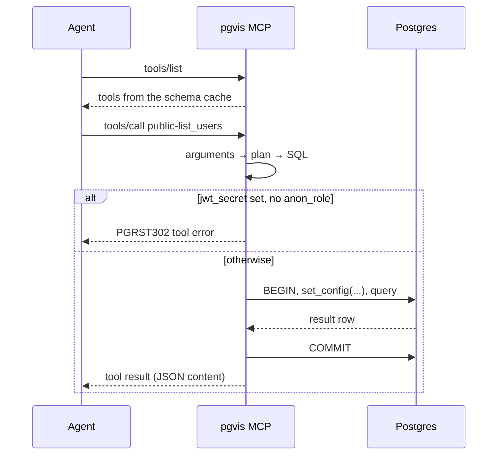

pgvis automatically generates [Model Context Protocol](https://modelcontextprotocol.io) tools from your database schema. Every table becomes a set of typed tools that LLM agents can discover and call — no glue code, no hand-written tool schemas.

## What Gets Generated

### Table tools

For each table in your exposed schemas, pgvis creates up to four tools:

| Tool | Purpose | Omitted when |
|------|---------|--------------|
| `list_{table}` | Query rows with filtering, ordering, pagination | Never |
| `create_{table}` | Insert one or more rows | `read_only = true` or table not insertable |
| `update_{table}` | Update rows matching a filter | `read_only = true` or table not updatable |
| `delete_{table}` | Delete rows matching a filter | `read_only = true` or table not deletable |

### Function tools

| Tool | Purpose | Omitted when |
|------|---------|--------------|
| `call_{function}` | Call the database function with typed arguments | `read_only = true` (all function tools, whatever their volatility) |

Overloaded functions share **one** tool. Its input schema is the union of the overloads' parameters, and a parameter is marked required only if every overload requires it. At call time the overload is picked from the argument names, exactly as `POST /rpc/{function}` does: an unknown or misspelled argument, or a missing required one, returns `PGRST202` (function not found); arguments that fit more than one overload return `PGRST203` (ambiguous).

### Tool naming

Tool names include the schema prefix by default. The MCP spec only allows `[a-zA-Z0-9_-]` in tool names, so the separator `routing.mcp_separator` is used only when it is an ASCII letter or digit, `_` or `-`; anything else — including the default `/` — becomes `-`:

```
public-list_users
public-create_users
public-call_search_items
analytics-list_events
```

With `mcp_separator = '_'`:

```
public_list_users
public_create_users
```

When `routing.schema_in_path = false`, the default schema prefix is omitted:

```
list_users             (public schema, default)
analytics-list_events  (non-default schema still prefixed)
```

## Transport: Stdio (Claude Desktop)

Add to your Claude Desktop MCP configuration (`~/.config/claude/mcp.json`):

```json
{
  "mcpServers": {
    "mydb": {
      "command": "pgvis",
      "args": ["--dsn", "postgres://user@localhost/mydb", "mcp"],
      "env": { "PGVIS_ANON_ROLE": "mcp_agent" }
    }
  }
}
```

Every tool call runs as the `anon_role` — see [Authentication](#authentication) for why you should set one.

### Read-only mode

For LLMs that should browse but not mutate:

```json
{
  "mcpServers": {
    "mydb": {
      "command": "pgvis",
      "args": ["--dsn", "postgres://user@localhost/mydb", "mcp", "--read-only"],
      "env": { "PGVIS_ANON_ROLE": "mcp_agent" }
    }
  }
}
```

This omits all `create_`, `update_`, `delete_` and `call_` tools from the tool catalogue, and rejects them (and `pubsub_publish`) at call time too, in case the client cached an older tool list. It is equivalent to `read_only = true` in the config file. The database role is still the real boundary: a read-only role is the safest pairing.

### Multiple schemas

```json
{
  "mcpServers": {
    "mydb": {
      "command": "pgvis",
      "args": [
        "--dsn", "postgres://user@localhost/mydb",
        "mcp",
        "--schema", "public",
        "--schema", "analytics"
      ]
    }
  }
}
```

`--schema` also accepts a comma-separated list (`--schema public,analytics`) and overrides any `schemas` from the config file or `PGVIS_SCHEMAS`.

### SQLite

```json
{
  "mcpServers": {
    "localdb": {
      "command": "pgvis",
      "args": ["--dsn", "sqlite:./mydata.db", "mcp"]
    }
  }
}
```

## Transport: Streamable HTTP

Run MCP alongside the REST API on the same port:

```bash
PGVIS_ANON_ROLE=mcp_agent pgvis --dsn "postgres://user@localhost/mydb" serve --mcp-http
```

The MCP endpoint is available at `/mcp` using the Streamable HTTP transport protocol. `pgvis serve` binds `127.0.0.1:3000` by default (pass `--bind 0.0.0.0:3000` to expose it) and refuses to start unless `jwt_secret` and/or `anon_role` is configured, or `--insecure-no-auth` is passed.

## Authentication

MCP has no token-passing mechanism in pgvis today, on either transport: tool calls never carry a JWT, and the `/mcp` endpoint does not read the `Authorization` header. Every tool call therefore runs as an anonymous caller:

| Configuration | What MCP tool calls run as |
|---------------|----------------------------|
| `anon_role` set | `role` set to `anon_role` for the transaction, no JWT claims |
| `jwt_secret` set, no `anon_role` | Refused — every tool returns `PGRST302` (anonymous access disabled) |
| Neither set | The DSN's own role (often the table owner, bypassing RLS) |

So give the agent its own database role with exactly the grants and RLS policies it should have, and set it as `anon_role` (config file, `PGVIS_ANON_ROLE`, or `Config::anon_role` when embedding):

```sql
CREATE ROLE mcp_agent NOLOGIN;
GRANT mcp_agent TO authenticator;           -- the DSN's login role
GRANT USAGE ON SCHEMA public TO mcp_agent;
GRANT SELECT ON ALL TABLES IN SCHEMA public TO mcp_agent;
```

Note that the `pgvis mcp` subcommand does not apply `serve`'s refusal to start without auth: with neither `jwt_secret` nor `anon_role` it runs every call as the DSN's role. For the HTTP transport, anyone who can reach `/mcp` gets the `anon_role`'s access — keep it on loopback or put an authenticating proxy in front of it.

## Discovery Resources

pgvis exposes MCP resources that agents can read for schema discovery:

| URI | Content |
|-----|---------|
| `pgvis://schemas` | JSON array of the exposed schema names |
| `pgvis://{schema}/schema` | `{"schema": ..., "tables": [...]}` — the tables and views in that schema |
| `pgvis://{schema}/{table}/columns` | JSON array of the table's columns: `name`, `type`, `nullable`, `has_default` |

These resources give the agent context about the database structure before it starts calling tools.

## Tool Input Schemas

Each tool has a JSON Schema for its inputs, generated from the database introspection. Filters are passed as one `filters` object mapping column → PostgREST operator syntax (`"eq.5"`, `"in.(1,2,3)"`, `"is.null"`, `"like.*foo*"`), using the same parser as the REST API.

### `list_{table}` example

```json wrap
{
  "name": "public-list_users",
  "description": "List rows from public.users with filtering, ordering, and embedding",
  "inputSchema": {
    "type": "object",
    "properties": {
      "select": { "type": "string", "description": "Comma-separated columns to return. Supports embedding: 'id,name,posts(title)'" },
      "filters": {
        "type": "object",
        "description": "Column filters as key-value pairs. Values use operator syntax: 'eq.5', 'gt.10', 'like.*foo*'",
        "additionalProperties": { "type": "string" }
      },
      "order": { "type": "string", "description": "Ordering: 'column.asc', 'column.desc.nullsfirst'" },
      "limit": { "type": "integer", "description": "Max rows to return" },
      "offset": { "type": "integer", "description": "Rows to skip" },
      "or": { "type": "string", "description": "OR logic filter using PostgREST syntax: '(col.eq.val1,col.eq.val2)'" },
      "and": { "type": "string", "description": "AND logic filter using PostgREST syntax: '(col.gte.1,col.lte.10)'" },
      "count": { "type": "boolean", "description": "If true, returns total count of matching rows alongside the data" }
    }
  }
}
```

`not.and` and `not.or` are also accepted. With `"count": true` the result is `{"rows": [...], "total": ..., "page_total": ...}` instead of a bare array.

### `create_{table}` example

```json wrap
{
  "name": "public-create_users",
  "description": "Insert rows into public.users",
  "inputSchema": {
    "type": "object",
    "properties": {
      "rows": {
        "oneOf": [
          { "type": "object", "description": "Single row to insert" },
          { "type": "array", "items": { "type": "object" }, "description": "Multiple rows" }
        ]
      },
      "select": { "type": "string", "description": "Columns to return from inserted rows" },
      "on_conflict": { "type": "string", "description": "Upsert resolution column" },
      "return": { "type": "string", "enum": ["representation", "minimal"] },
      "resolution": { "type": "string", "enum": ["merge-duplicates", "ignore-duplicates"] }
    },
    "required": ["rows"],
    "description": "Columns: id: int8 , name: text , email: text (nullable)"
  }
}
```

### `update_{table}` example

```json wrap
{
  "name": "public-update_users",
  "description": "Update rows in public.users matching filter conditions",
  "inputSchema": {
    "type": "object",
    "properties": {
      "values": { "type": "object", "description": "Column values to update" },
      "filters": {
        "type": "object",
        "description": "Column filters to match rows. Values use operator syntax: 'eq.5'",
        "additionalProperties": { "type": "string" }
      },
      "select": { "type": "string", "description": "Columns to return from updated rows" },
      "return": { "type": "string", "enum": ["representation", "minimal"] }
    },
    "required": ["values", "filters"]
  }
}
```

`delete_{table}` takes the same `filters`, `select` and `return` arguments, with `filters` required.

### `call_{function}` example

```json
{
  "name": "public-call_search_items",
  "description": "Call function public.search_items(query: text) → SETOF items",
  "inputSchema": {
    "type": "object",
    "properties": {
      "query": { "type": "string", "description": "Parameter: query (text)" }
    },
    "required": ["query"]
  }
}
```

Every argument other than the reserved request keys (`select`, `filters`, `order`, `limit`, `offset`, `count`, `and`, `or`, `not.and`, `not.or`, `on_conflict`, `return`, `resolution`) is passed to the function as a named argument.

## Write Safety

Write tools fail closed rather than widening what they touch:

- `update_` and `delete_` with no filter at all (no `filters` entry and no `and`/`or`) are refused — `required: ["filters"]` in the schema is only advisory, and `{}` would otherwise match every row.
- `filters` that is not an object (LLMs often send `"id.eq.5"` or a list) is an error, not "no filters".
- An unknown filter operator, a malformed `and`/`or` expression, a malformed `select` or a malformed `order` is an error, never silently dropped or replaced with a default.

These all return `PGRST100` parse errors as tool error results, so the agent can correct its call.

## Execution Flow

An agent first discovers the tools, then calls them. Each call is planned in-process and runs as one database transaction under the `anon_role`:



Step by step:

1. **Parse** — tool arguments are mapped to an `ApiRequest` (same as REST)
2. **Plan** — validated against the schema cache, relationships resolved
3. **Render** — parameterized SQL generated (dialect-aware)
4. **Execute** — SQL runs against the database as the `anon_role` (see [Authentication](#authentication)) with statement timeout
5. **Return** — rows (or error) returned as MCP tool result content

The MCP path uses the exact same pipeline as REST — behaviour never diverges. On Postgres the schema cache is reloaded on `NOTIFY pgrst, 'reload schema'`, so new tables and functions appear in the tool list without a restart.

## Preferences via Tool Arguments

MCP tools support the same preferences as the REST API's `Prefer` header:

```json
{
  "name": "public-create_users",
  "arguments": {
    "rows": { "name": "Alice", "email": "alice@example.com" },
    "on_conflict": "email",
    "return": "representation",
    "resolution": "merge-duplicates"
  }
}
```

## Statement Timeout

MCP tool calls respect the `statement_timeout_ms` configuration (default 30 s). The database aborts the query itself, and pgvis additionally bounds the whole call at the timeout plus one second, so a query that exceeds it returns an error result rather than hanging indefinitely.

## Embedding MCP in Your Own App

```rust
use pgvis_lib::Builder;

#[tokio::main]
async fn main() -> anyhow::Result<()> {
    let mut config = pgvis_lib::pgvis_core::Config::default();
    config.anon_role = Some("mcp_agent".into());

    // Build an MCP server for stdio transport
    let mcp = Builder::new("postgres://localhost/mydb")
        .config(config)
        .build_mcp_server()
        .await?;

    // Serve over stdio (Claude Desktop / agent integrations)
    pgvis_lib::pgvis_mcp::serve_stdio(mcp)
        .await
        .map_err(|e| anyhow::anyhow!(e))?;
    Ok(())
}
```

`serve_stdio` returns when the client disconnects, or after SIGINT/SIGTERM once the in-flight tool call has finished.

Or serve MCP alongside REST on HTTP:

```rust
use pgvis_lib::Builder;

let router = Builder::new("postgres://localhost/mydb")
    .with_mcp_http()
    .build()
    .await?;

// Router now serves REST at /api/... AND MCP at /mcp
let listener = tokio::net::TcpListener::bind("127.0.0.1:3000").await?;
axum::serve(listener, router).await?;
```

The library does not refuse to start without auth the way `pgvis serve` does: set `anon_role` in the `Config` you pass to `.config(...)`, or MCP calls run as the DSN's role.

## Pub/Sub Tools

When pub/sub is enabled (`pubsub.enabled = true` in config) on a Postgres database, the Streamable HTTP endpoint (`serve --mcp-http` / `with_mcp_http()`) gets two additional tools. The stdio server (`pgvis mcp` / `build_mcp_server()`) does not attach a pub/sub backend, so it never lists them.

| Tool | Purpose |
|------|---------|
| `pubsub_publish` | Publish a message to a named channel |
| `pubsub_channels` | List the channels this instance is listening on |

`pubsub_publish` runs as the `anon_role`, goes through `pubsub.authorize_function` (with `op = 'publish'`) when one is configured, and is refused in read-only mode.

### Example: Publishing from an agent

```json
{
  "name": "pubsub_publish",
  "arguments": {
    "channel": "alerts",
    "payload": "{\"level\":\"critical\",\"message\":\"disk full\"}"
  }
}
```

Agents can use pub/sub to notify external systems, coordinate multi-agent workflows, or stream progress updates. See the full [Pub/Sub guide](/guides/pubsub) for all details.
