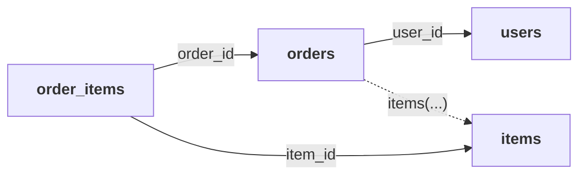

pgvis exposes a PostgREST-compatible REST API. If you've used PostgREST before, the query DSL is identical — existing clients work unchanged.

## Route Structure

Routes are determined by the [`routing`](/reference/configuration#routing) configuration.

### Schema-in-path mode (default)

| Method | Path | Purpose |
|--------|------|---------|
| `GET` | `/api/{schema}/{table}` | List rows (`HEAD`: headers only) |
| `POST` | `/api/{schema}/{table}` | Insert rows |
| `PATCH` | `/api/{schema}/{table}` | Update rows |
| `DELETE` | `/api/{schema}/{table}` | Delete rows |
| `POST` | `/api/{schema}/rpc/{function}` | Call a function |
| `GET` | `/api/{schema}/rpc/{function}` | Call a non-volatile function |
| `GET` | `/api/` | Exposed schemas, or the OpenAPI 3.0 spec |
| `GET` | `/pgvis/cache` | Data cache stats/settings and pool occupancy |

`GET /api/` returns `{"schemas": [...], "hint": ...}` by default; send `Accept: application/openapi+json` to get the OpenAPI 3.0 document instead (`404 PGRST404` when `openapi_mode` is disabled). Both `GET /api/` and `GET /pgvis/cache` authenticate exactly like the data API: when a `jwt_secret` is configured and there is no `anon_role`, an anonymous request gets `401`.

Example:
```bash
GET /api/public/users
GET /api/analytics/events
POST /api/public/rpc/search_items
```

### Flat mode (PostgREST-compatible)

With `routing.schema_in_path = false` and `routing.prefix = ""`:

```
GET /users
POST /rpc/my_function
GET /                — exposed schemas / OpenAPI spec
```

The schema is resolved from the `Accept-Profile` / `Content-Profile` header or the configured `default_schema`.

---

## Selecting Columns

Use the `select` query parameter to choose which columns appear in the response.

```bash
# All columns (default when select is omitted)
curl "/api/public/users"

# Specific columns
curl "/api/public/users?select=id,name,email"

# All columns explicitly
curl "/api/public/users?select=*"
```

### Column renaming

Rename columns in the response using `:` syntax:

```bash
curl "/api/public/users?select=user_id:id,display_name:name"
```

Response:
```json
[{"user_id": 1, "display_name": "Alice"}]
```

### Casts

Cast a column with `::type`; the cast is rendered as `CAST(col AS type)`. Array types are accepted:

```bash
curl "/api/public/items?select=id,price::text,tags::text[]"
```

The type name is restricted to letters, digits, `_`, spaces and `[]`; anything else is a `400`.

### JSON columns

Use `->` (JSON) and `->>` (text) to reach into `json`/`jsonb` columns, in both `select` and filters:

```bash
curl "/api/public/items?select=id,color:metadata->>color&metadata->>color=eq.red"
```

### Aggregates

When aggregates are enabled (`aggregates_enabled = true` in config):

```bash
curl "/api/public/items?select=category,total_price:price.sum(),avg_price:price.avg()"
```

Supported aggregate functions: `count`, `sum`, `avg`, `min`, `max`. The non-aggregated columns in `select` become the `GROUP BY` (here: `category`); there is no separate `group` parameter. A cast after the aggregate applies to its result (`price.sum()::int`). With aggregates disabled the request fails with `400 PGRST123`.

---

## Filtering

Filters use the `column=operator.value` syntax on query parameters. Any query parameter that isn't a reserved word (`select`, `order`, `limit`, `offset`, `on_conflict`, `columns`, `cursor_column`, `cursor_value`) or a logic key (`and`, `or`, `not.and`, `not.or`) is treated as a column filter.

- A malformed filter is a `400 PGRST100`; it is never silently dropped.
- A column may be filtered more than once: every value is kept, in order, and the filters are ANDed (`price=gte.10&price=lte.100`).
- A reserved word given twice (e.g. two `limit`s) is ambiguous and returns `400 PGRST100`.
- Filters apply to columns of the target table; filtering on an embedded resource's columns (`orders.status=eq.x`) is not supported and is a `400`.

### Comparison Operators

| Operator | SQL | Example |
|----------|-----|---------|
| `eq` | `=` | `name=eq.Widget` |
| `neq` | `!=` | `status=neq.archived` |
| `gt` | `>` | `price=gt.100` |
| `gte` | `>=` | `age=gte.18` |
| `lt` | `<` | `price=lt.50` |
| `lte` | `<=` | `priority=lte.3` |

```bash
# Items priced between 10 and 100
curl "/api/public/items?price=gte.10&price=lte.100"
```

### Pattern Matching

| Operator | SQL | Example |
|----------|-----|---------|
| `like` | `LIKE` | `name=like.*widget*` |
| `ilike` | `ILIKE` | `name=ilike.*Widget*` |
| `match` | `~` (regex) | `email=match.^admin` |
| `imatch` | `~*` (case-insensitive regex) | `email=imatch.^admin` |

Use `*` as the wildcard character (mapped to `%` in SQL):

```bash
# Names starting with "A"
curl "/api/public/users?name=like.A*"

# Case-insensitive search
curl "/api/public/items?name=ilike.*phone*"
```

> **Note:** `ilike`, `match`, and `imatch` are Postgres-only. On SQLite, `ilike` is automatically rewritten to a `LIKE` with `LOWER()`.

### IS Operators

| Operator | SQL | Example |
|----------|-----|---------|
| `is` | `IS` | `deleted_at=is.null` |
| `isdistinct` | `IS DISTINCT FROM` | `status=isdistinct.active` |

Valid `is` values: `null`, `notnull`, `true`, `false`, `unknown`.

```bash
# Rows where deleted_at is NULL
curl "/api/public/users?deleted_at=is.null"

# Rows where active is true
curl "/api/public/users?active=is.true"
```

### Set Operators

| Operator | SQL | Example |
|----------|-----|---------|
| `in` | `IN` | `status=in.(active,pending,review)` |

```bash
# Items in specific categories
curl "/api/public/items?category=in.(electronics,books,clothing)"
```

### Array / JSONB Operators (Postgres only)

| Operator | SQL | Description |
|----------|-----|-------------|
| `cs` | `@>` | Contains |
| `cd` | `<@` | Contained by |
| `ov` | `&&` | Overlaps |

```bash
# Array contains value
curl "/api/public/items?tags=cs.{electronics,sale}"

# JSONB contains
curl "/api/public/items?metadata=cs.{\"featured\":true}"
```

### Range Operators (Postgres only)

| Operator | SQL | Description |
|----------|-----|-------------|
| `sl` | `<<` | Strictly left |
| `sr` | `>>` | Strictly right |
| `nxr` | `&<` | Does not extend to the right |
| `nxl` | `&>` | Does not extend to the left |
| `adj` | `-|-` | Adjacent |

### Full-Text Search (Postgres only)

| Operator | SQL Function | Example |
|----------|-------------|---------|
| `fts` | `to_tsquery` | `description=fts.web+development` |
| `plfts` | `plainto_tsquery` | `description=plfts.web development` |
| `phfts` | `phraseto_tsquery` | `description=phfts.web development` |
| `wfts` | `websearch_to_tsquery` | `description=wfts.web development -mobile` |

Optional language config:

```bash
# Full-text search with English config
curl "/api/public/articles?body=fts(english).postgresql+tutorial"
```

### Quantifiers

Comparison and pattern operators support quantifiers for array/set matching:

| Quantifier | SQL | Example |
|-----------|-----|---------|
| `any` | `= ANY(...)` | `id=eq(any).{1,2,3}` |
| `all` | `= ALL(...)` | `score=gt(all).{80,90}` |

---

## Negation

Prefix any operator with `not.` to negate it:

```bash
# Not equal
curl "/api/public/items?status=not.eq.archived"

# Not in list
curl "/api/public/items?category=not.in.(deprecated,removed)"

# Not null
curl "/api/public/users?email=not.is.null"

# Not like
curl "/api/public/items?name=not.like.*test*"

# Not matching regex
curl "/api/public/users?email=not.match.^temp"
```

---

## Logic Filters

Combine filters with boolean logic using `and=` and `or=` query parameters.

### Basic OR

```bash
# Items that are either cheap OR in electronics
curl "/api/public/items?or=(price.lt.10,category.eq.electronics)"
```

### Basic AND (explicit)

```bash
# Items that are expensive AND in stock
curl "/api/public/items?and=(price.gt.100,in_stock.is.true)"
```

### Nested logic

```bash
# (price < 10 OR price > 1000) AND category = electronics
curl "/api/public/items?and=(or(price.lt.10,price.gt.1000),category.eq.electronics)"
```

### Combining with regular filters

Regular query parameter filters are ANDed together. Logic filters combine with them:

```bash
# in_stock = true AND (category = books OR category = electronics)
curl "/api/public/items?in_stock=is.true&or=(category.eq.books,category.eq.electronics)"
```

---

## Ordering

Use the `order` query parameter:

```bash
# Single column ascending (default direction)
curl "/api/public/items?order=name"

# Explicit direction
curl "/api/public/items?order=price.desc"

# Multiple columns
curl "/api/public/items?order=category.asc,price.desc"
```

### Null ordering

Control where NULLs appear:

```bash
# NULLs first
curl "/api/public/items?order=price.asc.nullsfirst"

# NULLs last
curl "/api/public/items?order=price.desc.nullslast"
```

---

## Pagination

### Offset / Limit

Classic pagination with `limit` and `offset`:

```bash
# First 10 rows
curl "/api/public/items?limit=10"

# Page 3 (rows 21-30)
curl "/api/public/items?limit=10&offset=20"
```

The response includes a `Content-Range` header (the total is `*` unless a count is requested):

```
Content-Range: 20-29/*
```

To get the total count, use `Prefer: count=exact`:

```bash
curl "/api/public/items?limit=10" -H "Prefer: count=exact"
# 206 Partial Content
# Content-Range: 0-9/156
```

When the total is known and rows remain beyond this page, the status is `206 Partial Content`; the last (or only) page is `200`. A non-numeric `limit`/`offset` is `416 PGRST103`. The server-side `max_rows` setting caps `limit` on reads.

### Cursor Pagination

For large datasets, cursor-based (keyset) pagination is more efficient than offset — it avoids the O(n) skip cost.

```bash
# First page: just specify the cursor column and limit
curl "/api/public/items?order=id.asc&cursor_column=id&limit=10"
```

The response includes an `X-Next-Cursor` header with the last row's cursor value:

```
X-Next-Cursor: 10
```

Use that value for the next page:

```bash
# Next page
curl "/api/public/items?order=id.asc&cursor_column=id&cursor_value=10&limit=10"
```

#### How it works

- Adds `WHERE id > $cursor_value` (for ascending) or `WHERE id < $cursor_value` (for descending)
- Automatically injects the cursor column into `ORDER BY` if not already present
- Ignores any `offset` parameter when cursor is active
- Returns `X-Next-Cursor` header only when there are results

#### Default to primary key

If `cursor_column` is omitted but the table has a primary key, the PK is used automatically:

```bash
# Uses the table's primary key as cursor column
curl "/api/public/items?cursor_value=42&limit=10"
```

#### With descending order

```bash
# Newest first, paginate backward
curl "/api/public/items?order=id.desc&cursor_column=id&cursor_value=100&limit=10"
# SQL: WHERE id < 100 ORDER BY id DESC LIMIT 10
```

#### Error cases

- If the cursor column doesn't exist → `400 PGRST204`
- If the table has no PK and no `cursor_column` is specified → `416 PGRST103`

---

## Resource Embedding

Traverse foreign-key relationships and embed related resources as nested JSON using the `select` parameter.

The examples below use this schema. Solid arrows are foreign keys; an embed can follow one in either direction, and the dashed edge is the many-to-many relationship pgvis derives from the `order_items` junction table:



| From | Embed | Direction | Shape in the JSON |
|------|-------|-----------|-------------------|
| `orders` | `users(...)` | many-to-one | object (or `null`) |
| `users` | `orders(...)` | one-to-many | array |
| `orders` | `items(...)` | many-to-many | array |

### Many-to-one (child → parent)

```bash
# Orders with their user (orders.user_id → users.id)
curl "/api/public/orders?select=id,total,users(id,name)"
```

Response:
```json
[
  {
    "id": 1,
    "total": 99.99,
    "users": {"id": 1, "name": "Alice"}
  }
]
```

### One-to-many (parent → children)

```bash
# Users with their orders (users.id ← orders.user_id)
curl "/api/public/users?select=id,name,orders(id,total,status)"
```

Response:
```json
[
  {
    "id": 1,
    "name": "Alice",
    "orders": [
      {"id": 1, "total": 99.99, "status": "completed"},
      {"id": 2, "total": 45.00, "status": "pending"}
    ]
  }
]
```

### Many-to-many (via junction table)

```bash
# Orders with their items (via order_items junction)
curl "/api/public/orders?select=id,total,items(id,name,price)"
```

pgvis automatically detects M2M relationships through junction tables.

### Nested embedding

```bash
# Users → Orders → Items (three levels)
curl "/api/public/users?select=id,name,orders(id,total,items(name,price))"
```

### Filtering on parent

```bash
# Orders for a specific user, with items embedded
curl "/api/public/orders?user_id=eq.1&select=id,total,items(*)"
```

### Column selection on embedded resources

```bash
# Only specific columns from the embedded resource
curl "/api/public/orders?select=id,users(name,email)"
```

### Hints and inner joins

```bash
# Disambiguate when two foreign keys link the same tables
curl "/api/public/orders?select=id,users!orders_billing_user_fk(name)"

# Only orders that have at least one item (the embed acts as an inner join)
curl "/api/public/orders?select=id,items!inner(name)"
```

An ambiguous embed without a hint is `300 PGRST201`; a missing relationship is `400 PGRST200`.

---

## Mutations

### INSERT (POST)

```bash
# Single row
curl -X POST "/api/public/items" \
  -H "Content-Type: application/json" \
  -d '{"name": "Widget", "price": 9.99, "category": "gadgets"}'

# Bulk insert
curl -X POST "/api/public/items" \
  -H "Content-Type: application/json" \
  -d '[{"name": "A", "price": 1.0}, {"name": "B", "price": 2.0}]'
```

On Postgres the rows travel as a single JSON parameter read through `json_populate_recordset`, so there is no bind-parameter ceiling on bulk inserts, and JSON arrays/objects land in array, composite and `json` columns. In a bulk insert the column list is the union of every row's keys; a row that omits one of them inserts `NULL` for it.

An insert answers `201 Created` (empty body unless `Prefer: return=representation`). For a single-row insert into a table with a primary key, a `Location` header points at the new row (`/api/public/items?id=eq.42`).

### Body validation

Bodies are checked against the table before any SQL is built:

| Body | Result |
|------|--------|
| Not a JSON object or an array of objects | `400 PGRST102` |
| A key that isn't a column of the table | `400 PGRST204` (with a "did you mean" hint) |
| `[]` or bulk rows with no columns | `400 PGRST102` |
| PATCH with an array, or with `{}` | `400 PGRST102` |
| `limit`/`offset` on an insert | `400 PGRST100` |

### UPSERT (POST with conflict resolution)

```bash
# Insert or update on conflict (merge duplicates)
curl -X POST "/api/public/items" \
  -H "Content-Type: application/json" \
  -H "Prefer: resolution=merge-duplicates" \
  -d '{"id": 1, "name": "Updated Widget", "price": 12.99}'

# Insert or ignore on conflict
curl -X POST "/api/public/items" \
  -H "Prefer: resolution=ignore-duplicates" \
  -d '{"id": 1, "name": "Ignored", "price": 0}'
```

### UPDATE (PATCH)

Updates rows matching the filter criteria:

```bash
# Update price for a specific item
curl -X PATCH "/api/public/items?id=eq.1" \
  -H "Content-Type: application/json" \
  -d '{"price": 12.99}'

# Update multiple rows
curl -X PATCH "/api/public/items?category=eq.gadgets" \
  -H "Content-Type: application/json" \
  -d '{"in_stock": false}'
```

> ⚠️ A PATCH without filters updates ALL rows. Be careful.

### DELETE

Deletes rows matching the filter criteria:

```bash
# Delete a specific item
curl -X DELETE "/api/public/items?id=eq.1"

# Delete with multiple filters
curl -X DELETE "/api/public/items?category=eq.deprecated&in_stock=is.false"
```

By default PATCH and DELETE answer `204 No Content`; send `Prefer: return=representation` to get the affected rows back with `200`.

### Limited UPDATE / DELETE

`limit` and `offset` (with an optional `order`) bound how many rows a PATCH or DELETE changes. The rows are picked by a subquery on the row identifier (`ctid` on Postgres, `rowid` on SQLite):

```bash
# Delete the 10 oldest archived items
curl -X DELETE "/api/public/items?status=eq.archived&order=created_at.asc&limit=10"
# WHERE ctid IN (SELECT ctid FROM items WHERE status = $1 ORDER BY created_at ASC LIMIT 10)
```

Views have no row identifier, so a limited PATCH/DELETE on a view is a `400`. The server's `max_rows` cap never applies to mutations.

### Mutation guards

Two guards are checked against the affected-row count **inside the transaction, before COMMIT**; a violation rolls the whole statement back, so no rows change:

| Request | Violation |
|---------|-----------|
| `Prefer: handling=strict, max-affected=N` | more than `N` rows affected → `400 PGRST124` |
| `Accept: application/vnd.pgrst.object+json` | anything but exactly one row affected → `406 PGRST116` |

```bash
# Refuse (and roll back) if this would delete more than one row
curl -X DELETE "/api/public/items?name=eq.Widget" \
  -H "Prefer: handling=strict, max-affected=1"

# Update exactly one row, returning it as an object
curl -X PATCH "/api/public/items?id=eq.1" \
  -H "Content-Type: application/json" \
  -H "Accept: application/vnd.pgrst.object+json" \
  -H "Prefer: return=representation" \
  -d '{"price": 12.99}'
```

`max-affected` is only enforced together with `handling=strict` (PostgREST semantics); without it the preference is ignored and not echoed in `Preference-Applied`.

### Getting the result back

Use `Prefer: return=representation` to get the affected rows in the response:

```bash
curl -X POST "/api/public/items" \
  -H "Content-Type: application/json" \
  -H "Prefer: return=representation" \
  -d '{"name": "New Item", "price": 5.99}'
```

Response (201 Created):
```json
[{"id": 42, "name": "New Item", "price": 5.99, "category": null, "in_stock": true}]
```

---

## RPC (Function Calls)

Database functions are called via `POST /api/{schema}/rpc/{function_name}`:

```bash
# Call a function with arguments
curl -X POST "/api/public/rpc/add" \
  -H "Content-Type: application/json" \
  -d '{"a": 2, "b": 3}'

# Function returning a set (table-like)
curl -X POST "/api/public/rpc/search_items" \
  -H "Content-Type: application/json" \
  -d '{"query": "widget"}'

# Function with default parameters
curl -X POST "/api/public/rpc/echo_params" \
  -H "Content-Type: application/json" \
  -d '{"name": "World"}'
```

Arguments are passed by name (`"a" := $1`). Values are sent to Postgres as text and cast by the function's declared parameter types; JSON arrays and objects are sent as their JSON text. A function returning a single scalar responds with the bare value (`5`, not `[{"result": 5}]`).

For a function that returns a set of a known table type, the usual query parameters (`select`, filters, `order`, `limit`, `offset`) on a `POST` apply to the returned rows.

### Overloads and unknown arguments

The overload is chosen by argument **names**: a candidate must declare every supplied argument and receive every parameter that has no default.

| Situation | Result |
|-----------|--------|
| Unknown function, misspelled/unknown argument, or a required argument missing | `404 PGRST202` |
| More than one overload matches | `300 PGRST203` |

### Volatility-based routing

- `STABLE` / `IMMUTABLE` functions → also accessible via `GET /rpc/{name}?arg=value`
- `VOLATILE` functions → `POST` only. A `GET`/`HEAD` call is refused with `405 PGRST101`, so a link or crawler can't trigger writes. Volatile calls always run on the primary, never a read replica.

On a `GET` call, every query parameter except the reserved words (`select`, `order`, `limit`, `offset`, …) is a named argument, passed through as text (so `zip=02134` stays `'02134'`). An unknown parameter name therefore resolves no overload and is a `404 PGRST202`.

```bash
curl "/api/public/rpc/add?a=2&b=3"
# 5
```

### Raising errors from a function

A function chooses the HTTP status of its error through the SQLSTATE it raises:

```sql
-- 400 Bad Request: plain RAISE EXCEPTION uses SQLSTATE P0001
RAISE EXCEPTION 'insufficient funds' USING HINT = 'Top up first';

-- Any status: PTxyz → HTTP xyz (PostgREST convention)
RAISE EXCEPTION 'payment required' USING ERRCODE = 'PT402';
RAISE EXCEPTION 'not yours' USING ERRCODE = 'PT403';
```

The response body's `code` is the SQLSTATE (`P0001`, `PT402`, …) and `hint`/`details` carry the exception's `HINT`/`DETAIL`. A `PT` code that isn't a valid status (100–599) is a `500`. Other SQLSTATEs map as listed under [Database errors](#database-errors).

### Response status and headers from SQL

On Postgres a function (or the `pre_request` hook) can override the response status and add headers through transaction-local settings, as in PostgREST:

```sql
PERFORM set_config('response.status', '202', true);
PERFORM set_config('response.headers', '[{"X-Job-Id": "42"}]', true);
```

### JWT claims in SQL

The verified JWT's claims are available as one JSON setting, `request.jwt.claims`; the per-claim `request.jwt.claim.<key>` settings are not set:

```sql
SELECT current_setting('request.jwt.claims', true)::json->>'sub';
```

---

## Prefer Header

The `Prefer` header controls response behaviour. Multiple preferences can be combined with commas.

### `return`

Controls what the response body contains after mutations:

| Value | Behaviour |
|-------|-----------|
| `representation` | Return the affected rows as JSON |
| `minimal` | Return empty body (just status code + headers) |
| `headers-only` | Return empty body with headers showing affected count |

```bash
curl -X POST "/api/public/items" \
  -H "Prefer: return=representation" \
  -d '{"name": "Test"}'
```

### `count`

Controls whether and how total count is computed:

| Value | Behaviour |
|-------|-----------|
| `exact` | Full `COUNT(*)` — accurate but potentially slow |
| `planned` | Accepted, but not computed yet: the total stays `*` |
| `estimated` | Accepted, but not computed yet: the total stays `*` |

```bash
curl "/api/public/items?limit=10" -H "Prefer: count=exact"
# Content-Range: 0-9/1523
```

### `resolution`

Controls UPSERT conflict handling (used with POST):

| Value | Behaviour |
|-------|-----------|
| `merge-duplicates` | `ON CONFLICT DO UPDATE` |
| `ignore-duplicates` | `ON CONFLICT DO NOTHING` |

### `handling`

| Value | Behaviour |
|-------|-----------|
| `strict` | Unknown preferences or invalid preference values return `400 PGRST122`; enables `max-affected` |
| `lenient` | Unknown preferences are silently ignored (the default) |

### `missing`

Parsed (`default` or `null`) and echoed in `Preference-Applied`, but not yet applied: keys missing from a bulk-insert row currently insert `NULL` (see [INSERT](#insert-post)).

### `tx`

Controls transaction end behaviour (requires `tx_allow_override = true` in config):

| Value | Behaviour |
|-------|-----------|
| `commit` | Normal commit (default) |
| `rollback` | Roll back the transaction (useful for testing/dry-run) |

### `timezone`

Parsed and echoed in `Preference-Applied`, but not yet applied to the session: the request runs in the database's configured timezone.

```bash
curl "/api/public/events" -H "Prefer: timezone=America/New_York"
```

### `max-affected`

Fail the request, and roll it back, when a PATCH/DELETE (or insert) affects more than `N` rows. Only enforced together with `handling=strict`; see [Mutation guards](#mutation-guards).

```bash
curl -X DELETE "/api/public/items?status=eq.old" \
  -H "Prefer: handling=strict, max-affected=10"
# more than 10 matching rows → 400 PGRST124, nothing deleted
```

### `params`

| Value | Behaviour |
|-------|-----------|
| `multiple-objects` | Each top-level body key is a separate named argument (the default, and the only mode) |

`params=single-object` was removed in PostgREST v13 and is treated as an unknown preference (`400 PGRST122` under `handling=strict`).

When the same preference appears twice, the first occurrence wins.

---

## Response Headers

### Content-Range

Present on every successful response. The range starts at the request's `offset`; the end saturates rather than overflowing on a huge client-supplied offset:

```
Content-Range: 0-24/*      (count not requested)
Content-Range: 0-24/156    (with Prefer: count=exact)
Content-Range: */*          (empty result, no count)
Content-Range: */0          (empty result, with Prefer: count=exact)
```

### Location

Set on a single-row insert into a table with a primary key: `Location: /api/public/items?id=eq.42`.

### X-Next-Cursor

Present when using cursor pagination and there are results:

```
X-Next-Cursor: 42
```

### Content-Type

```
Content-Type: application/json; charset=utf-8
```

### Preference-Applied

Echoes back the preferences that were parsed (`max-affected` only when `handling=strict`, `tx` only when `tx_allow_override` is on):

```
Preference-Applied: return=representation, count=exact
```

### Response body

For table reads the body is Postgres's own `json_agg` text, forwarded to the client as bytes without being parsed and re-serialized. Numbers reach the client exactly as Postgres rendered them, and the text keeps Postgres's spacing (`{"id": 1, "name": "Widget"}`).

---

## Query Plan (planned)

The `plan_enabled` config flag exists, but the REST router does not serve `Accept: application/vnd.pgrst.plan+json` yet; such a request is answered like a normal read.

---

## Error Format

Errors follow PostgREST conventions with JSON body and appropriate HTTP status:

```json
{
  "code": "PGRST204",
  "message": "Column 'nme' not found in 'items'",
  "details": null,
  "hint": "Did you mean: name?"
}
```

### Error Codes

| Code | HTTP Status | Meaning |
|------|-------------|---------|
| `PGRST000` | 503 | Database unavailable: pool exhausted (checkout timed out) or unreachable — retryable |
| `PGRST100` | 400 | Malformed `select`, filter, `order` or `and=`/`or=`; a reserved parameter given twice; `limit`/`offset` on an insert or on a view's PATCH/DELETE |
| `PGRST101` | 405 | Volatile function called with `GET`/`HEAD` |
| `PGRST102` | 400 | Invalid request body |
| `PGRST103` | 416 | Invalid `limit`/`offset`; cursor pagination on a table without a primary key |
| `PGRST116` | 406 | Singular response requested but not exactly one row |
| `PGRST119` | 400 | Spread (`...`) on a to-many relationship |
| `PGRST122` | 400 | Invalid preference (with `handling=strict`) |
| `PGRST123` | 400 | Aggregates disabled |
| `PGRST124` | 400 | `max-affected` exceeded (transaction rolled back) |
| `PGRST200` | 400 | Relationship not found |
| `PGRST201` | 300 | Ambiguous relationship — add a `!hint` |
| `PGRST202` | 404 | Function not found, or no overload accepts the argument names |
| `PGRST203` | 300 | Ambiguous function overload |
| `PGRST204` | 400 | Column not found |
| `PGRST205` | 404 | Table/view not found |
| `PGRST300` | 401 | JWT required but not provided (no `anon_role`) |
| `PGRST301` | 401 | JWT invalid, wrong audience, not yet valid, or carries no role claim while no `anon_role` is set (500 if the configured key itself is unusable) |
| `PGRST302` | 401 | JWT expired |
| `PGRST404` | 404 | OpenAPI requested while `openapi_mode` is disabled |
| `PGV001` | 400 | Operation not supported by this backend (501 for the unimplemented inspect endpoint) |
| `PGV500` | 500 | Internal error |

### Database errors

When Postgres rejects the statement, `code` is the SQLSTATE and `details`/`hint` carry the server's `DETAIL`/`HINT`. The HTTP status is chosen from the SQLSTATE:

| SQLSTATE | HTTP Status | Meaning |
|----------|-------------|---------|
| `23505`, `23503` | 409 | Unique / foreign-key violation |
| `23502`, `23514` | 400 | Not-null / check violation |
| `22P02`, `22003`, `22007` | 400 | Invalid text, numeric or datetime input |
| `P0001` | 400 | `RAISE EXCEPTION` in a function |
| `PTxyz` | xyz | Custom status chosen by a function (e.g. `PT402` → 402) |
| `42501` | 403 | Insufficient privilege |
| `42P01` | 404 | Undefined table |
| `42883` | 404 | Undefined function |
| `25006` | 405 | Write in a read-only transaction |
| `57014` | 504 | Statement timeout (query canceled) |
| `08xxx` | 503 | Connection exception |
| anything else | 500 | |

---

## Schema Selection

### Via URL path (default)

With `routing.schema_in_path = true`:

```bash
GET /api/public/users     → public schema
GET /api/analytics/events → analytics schema
```

### Via header

With `routing.schema_in_path = false`:

```bash
# Read requests
GET /users -H "Accept-Profile: analytics"

# Write requests
POST /items -H "Content-Profile: analytics"
```

When no profile header is sent, the `routing.default_schema` is used.

---

## Content Negotiation

| Accept header | Response format |
|--------------|-----------------|
| `application/json` (default) | JSON array |
| `application/vnd.pgrst.object+json` | Single JSON object; anything but exactly one row is `406 PGRST116` (for mutations, checked before COMMIT and rolled back) |
| `application/vnd.pgrst.plan+json` | Query execution plan (planned) |
| `text/csv` | CSV format (planned) |

---

## Examples

### Complete CRUD workflow

```bash
BASE="http://localhost:3000/api/public"

# Create
curl -X POST "$BASE/items" \
  -H "Content-Type: application/json" \
  -H "Prefer: return=representation" \
  -d '{"name": "Laptop", "price": 999.99, "category": "electronics"}'
# → [{"id": 1, "name": "Laptop", "price": 999.99, ...}]

# Read with filter
curl "$BASE/items?category=eq.electronics&order=price.desc"

# Update
curl -X PATCH "$BASE/items?id=eq.1" \
  -H "Content-Type: application/json" \
  -H "Prefer: return=representation" \
  -d '{"price": 899.99}'

# Delete
curl -X DELETE "$BASE/items?id=eq.1"
```

### Paginated list with cursor

```bash
# First page
RESPONSE=$(curl -sD - "$BASE/items?order=id.asc&cursor_column=id&limit=20")
CURSOR=$(echo "$RESPONSE" | grep -i x-next-cursor | cut -d: -f2 | tr -d ' \r')

# Next page
curl "$BASE/items?order=id.asc&cursor_column=id&cursor_value=$CURSOR&limit=20"
```

### Complex query with embedding and logic filters

```bash
# Active users with their orders (nested items included)
# who are either admins OR were created this year
curl "$BASE/users?select=id,name,email,orders(id,total,status,items(name,price))&\
active=is.true&\
or=(role.eq.admin,created_at.gte.2026-01-01)&\
order=name.asc&\
limit=50"
```

---

## Schema Reload

The schema cache is loaded at startup and hot-swapped when the database schema changes, so new tables and functions become routable without a restart (Postgres):

```sql
NOTIFY pgrst, 'reload schema';   -- or an empty payload, as in PostgREST
```

`kill -USR1 <pgvis pid>` triggers the same reload. Bursts of notifications are coalesced, in-flight requests finish on the cache they started with, a failed re-introspection keeps the current cache, and the data cache drops every entry built against the old schema.

---

## Pub/Sub (Real-time Messaging)

pgvis includes a general-purpose pub/sub system backed by Postgres `LISTEN/NOTIFY`. When enabled (`--pubsub-enabled`), the REST surface gains additional endpoints:

### Subscribe (SSE)

```bash
# Open an SSE stream on a channel
curl -N -H "Accept: text/event-stream" \
  http://localhost:3000/pubsub/chat
```

### Publish

```bash
# Send a message to all subscribers
curl -X POST http://localhost:3000/pubsub/chat \
  -H "Content-Type: text/plain" \
  -d '{"user":"alice","text":"hello"}'
```

### Status

```bash
# List active channels
curl http://localhost:3000/pubsub
```

See the full [Pub/Sub guide](/guides/pubsub) for details on configuration, channel allowlists, and cross-instance messaging.
