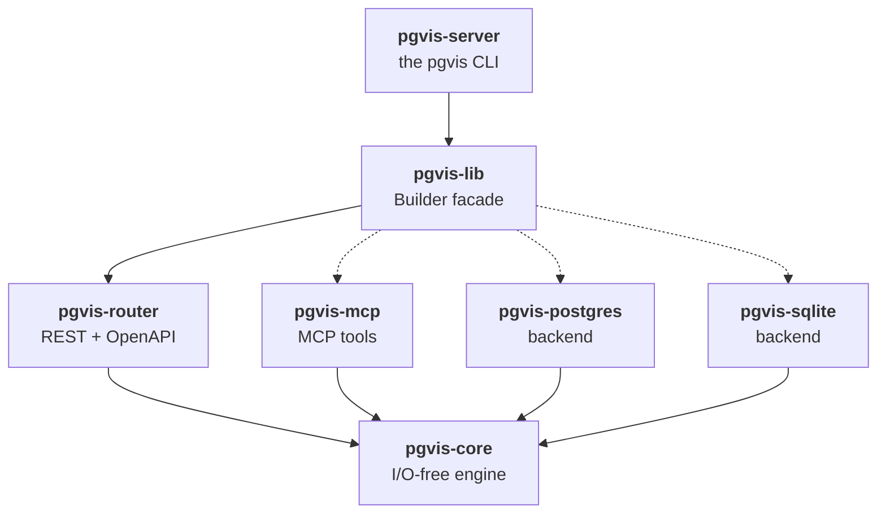
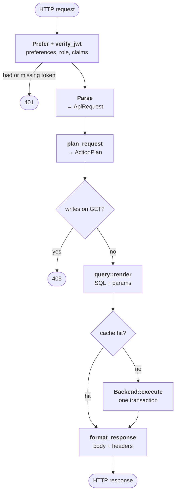
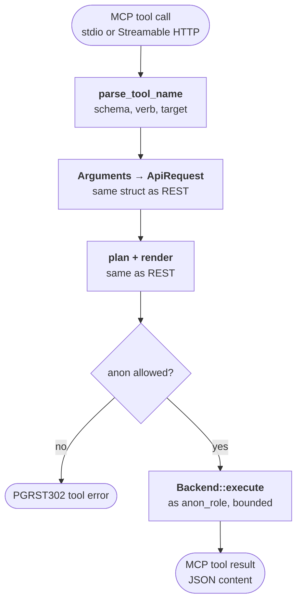
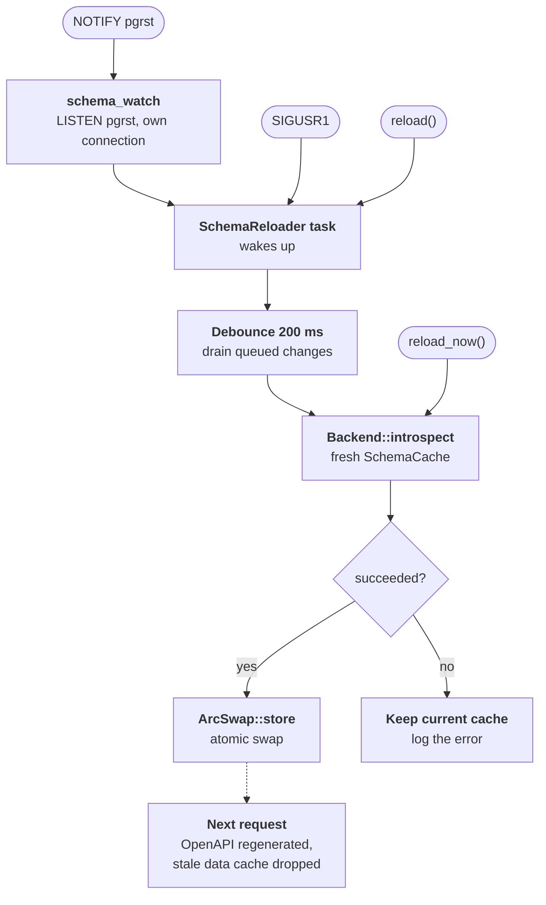
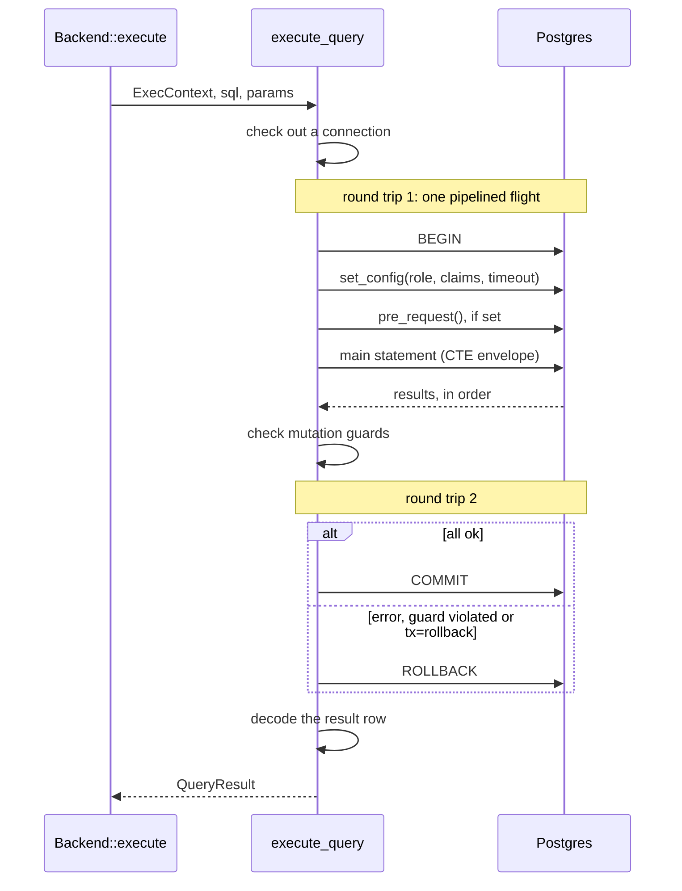
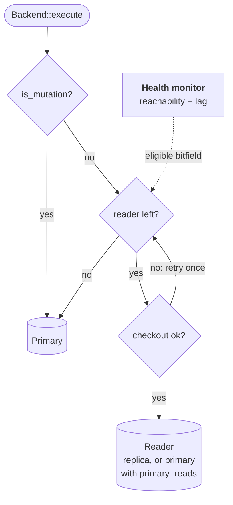

pgvis is a seven-crate Rust workspace. All dependencies point inward to the I/O-free core — the engine is embeddable, testable, and backend-agnostic.

## Crate Map

Every crate depends on `pgvis-core`; nothing depends on the binary. `pgvis-lib` wires the surfaces and backends together, and its MCP, Postgres and SQLite dependencies are default-on Cargo features (dashed). `pgvis-lib` and `pgvis-server` also use `pgvis-core` directly; those edges are omitted for clarity.



| Crate | Role | Key modules |
|-------|------|-------------|
| `pgvis-core` | Parser, planner, SQL builder, schema cache types, config, error codes | `query_params`, `plan`, `query`, `cache`, `config`, `dialect` |
| `pgvis-postgres` | Pool (rustls TLS), introspection, pipelined execution, read replicas, schema-change listener | `introspect`, `execute`, `replica`, `schema_watch`, `pubsub` |
| `pgvis-sqlite` | Introspection from `sqlite_master`, execution via rusqlite | `introspect`, `execute` |
| `pgvis-router` | axum REST router, OpenAPI 3.0 generator, read data cache | `routing`, `response`, `openapi`, `data_cache`, `pubsub` |
| `pgvis-mcp` | MCP tool generation and execution, stdio + Streamable HTTP | `tools`, `server`, `transport` |
| `pgvis-lib` | `Builder` API — the single way to assemble the stack | `Builder`, `Components`, `SchemaReloader` |
| `pgvis-server` | The `pgvis` CLI: `serve`, `mcp`, `openapi`, `inspect` | `main` (clap + figment) |

## Request Lifecycle

### REST path

An axum handler authenticates first, then lowers the request through the shared core pipeline. Two exits skip the database: a `GET`/`HEAD` on a plan that writes (a volatile function) is a `405`, and a data cache hit is served from memory.



| Step | Details |
|------|---------|
| Prefer + JWT | Unknown preferences are a `400` under `handling=strict`; the JWT is verified before any planning work |
| Parse | The query string is kept as ordered pairs (repeated keys preserved) and parsed into `SelectItem`s, `Filter`s, `LogicTree`s, `OrderTerm`s, a `RangeSpec`, a `CursorSpec` and the JSON `RequestBody` |
| Plan | Tables, columns and mutation bodies validated; embeds, RPC overloads and the cursor resolved; dialect capabilities checked → `ReadPlan`, `MutatePlan`, `CallPlan` or `InspectPlan` |
| Render | `$1, $2, …` placeholders — never string interpolation |
| Data cache | Reads only, when enabled and no `pre_request` hook is set. After execution a read is stored, a mutation bumps its table's generation, a volatile RPC bumps the global generation |
| Execute | One pipelined flight, mutation guards checked on the row count, then `COMMIT` or `ROLLBACK` — see [The Postgres Executor](#the-postgres-executor) |
| Format | JSON body (table reads forward Postgres's JSON text as bytes), `Content-Range` (`206` when more rows remain), `Location`, `X-Next-Cursor`, and the `response.status` / `response.headers` overrides |

### MCP path

An MCP tool call takes the same parse → plan → render → execute route, entering through the tool name instead of a URL. It never consults the data cache and always runs as `anon_role` (see [MCP authentication](/guides/mcp#authentication)): anonymous access is refused when `jwt_secret` is set without an `anon_role`, and each call is bounded by `statement_timeout_ms` plus one second.



## The Core Pipeline

### Stage 1: Parsing (`query_params`)

The `query_params` module uses **winnow** parser combinators to parse the PostgREST query DSL:

- `select=id,name,orders(*)` → `Vec<SelectItem>` (columns, aggregates, embedded resources)
- `price=gte.100` → `Filter { column, operator: Gte, value: "100" }`
- `or=(price.lt.10,price.gt.100)` → `LogicTree::Or(vec![...])`
- `order=name.asc.nullsfirst` → `OrderTerm { column, direction, nulls }`
- `cursor_column=id&cursor_value=42` → `CursorSpec { column, value }`

Parser output is **syntactic only** — names are just strings, not yet validated against the schema. `select=` and `and=`/`or=` nesting is capped at 32 levels before parsing, so a deeply nested query string can't overflow the stack. Malformed input is a `400`, never silently dropped.

### Stage 2: Planning (`plan`)

The planner validates and resolves parsed input against the `SchemaCache`:

- Verifies tables/columns exist (with typo suggestions via Levenshtein distance)
- Resolves foreign-key relationships for embedding
- Applies `Dialect` capability checks (e.g., `ILIKE` → `LIKE+LOWER` on SQLite)
- Resolves cursor to keyset WHERE condition with correct comparison operator
- Validates mutation bodies (object or array of objects, every key a known column, non-empty PATCH) before any SQL is rendered
- Picks the RPC overload whose parameter names cover every supplied argument and whose required parameters are all supplied (none → `PGRST202`, several → `PGRST203`)
- Produces a fully-resolved `ActionPlan`:
  - `ReadPlan` — SELECT with joins, filters, ordering, cursor, pagination
  - `MutatePlan` — INSERT/UPDATE/DELETE with conflict resolution
  - `CallPlan` — RPC function call with typed parameters
  - `InspectPlan` — schema inspection

### Stage 3: SQL Builder (`query`)

Renders `ActionPlan` into parameterized SQL:

- Uses a `RenderContext` that manages parameter indices (`$1`, `$2`, ...)
- CTE envelope: wraps the statement in `WITH pgrst_source AS (...) SELECT ...` so every query returns one row: `body` (`json_agg`), `page_total`, optional `total_count`, and (Postgres) the `response.status` / `response.headers` GUCs
- Dialect-aware: PostgreSQL vs SQLite syntax differences
- Embedding: correlated subqueries (`row_to_json` for to-one, `json_agg` for to-many); a `!inner` embed adds an `EXISTS` predicate
- Cursor: injects `WHERE column > $N` (ascending) or `WHERE column < $N` (descending)
- Inserts (Postgres): `INSERT … SELECT cols FROM json_populate_recordset(NULL::table, $1::json)` — the whole payload is one JSON parameter, so the SQL text is constant for any row count and there is no bind-parameter ceiling. SQLite keeps one parameter per value.
- Limited PATCH/DELETE: `limit`/`offset`/`order` select rows through the dialect's row identifier: `WHERE ctid IN (SELECT ctid FROM t WHERE … ORDER BY … LIMIT n)` (`rowid` on SQLite)
- An empty value list (`IN`, or an `any`/`all` quantifier) renders as a constant `FALSE`/`TRUE` instead of invalid `IN ()` / untyped `ARRAY[]`; `::type` casts render as `CAST(expr AS type)` with a restricted type charset (array types such as `text[]` allowed)

## Schema Cache

The `SchemaCache` is the introspected database metadata snapshot. It contains:

| Type | Content |
|------|---------|
| `Table` | Name, columns, primary key, insertable/updatable/deletable flags, comments |
| `Column` | Name, type, nullable, default, is_pk, max_length |
| `Relationship` | Foreign key relationships (M2O, O2M, M2M via junction tables) |
| `Routine` | Functions (all overloads per name): parameters, return type, volatility |
| `UniqueConstraint` | Unique indexes for upsert resolution |

Introspection understands PostgreSQL 18 catalogs: virtual generated columns are read-only, a `NOT VALID` `NOT NULL` constraint leaves the column nullable, and temporal (`WITHOUT OVERLAPS`) keys are not used as primary keys or embedding joins.

The cache is loaded at startup and stored in an `Arc<ArcSwap<SchemaCache>>`. Handlers load a snapshot per request, so a swap never disturbs in-flight requests.

### Schema reload

`SchemaReloader` (in `pgvis-lib`, spawned by the `Builder` and exposed as `Components::reloader`) re-introspects and atomically stores a fresh cache when:

- the backend's `watch_schema()` stream fires — on Postgres, `schema_watch.rs` runs `LISTEN pgrst` on a dedicated connection (PostgREST's convention: `NOTIFY pgrst, 'reload schema'` or an empty payload), reconnecting with backoff and reporting one change after a reconnect in case one was missed; the replica backend watches its primary;
- the `pgvis serve` process receives `SIGUSR1`;
- an embedder calls `reload()` (fire-and-forget) or `reload_now()` (awaits the swap).

The three triggers converge on one reload task. `reload_now()` introspects immediately; everything else waits out the debounce first:



Bursts of changes are debounced (200 ms) into one introspection. A failed introspection keeps the current cache. The OpenAPI document is regenerated lazily for the new cache, and the data cache drops every entry built against the old one (it compares the cache's `built_at` stamp).

## The `Dialect` System

Instead of a trait per backend, pgvis uses a **data struct** with boolean capability flags:

```rust
pub struct Dialect {
    pub identifier_quote: char,          // "
    pub placeholder: Placeholder,        // $1 (Numbered) vs ?
    pub json_array_agg: &'static str,    // json_agg / json_group_array
    pub supports_set_local: bool,        // transaction-local role/GUCs
    pub has_routines: bool,              // /rpc/* calls
    pub supports_ilike: bool,            // ILIKE keyword
    pub supports_regex_match: bool,      // ~ and ~* operators
    pub supports_array_ops: bool,        // @>, <@, &&
    pub supports_range_ops: bool,        // <<, >>, &<, &>, -|-
    pub supports_fts: bool,              // to_tsquery, @@
    pub supports_quantifiers: bool,      // op(any) / op(all)
    pub supports_json_recordset: bool,   // json_populate_recordset inserts
    pub row_identifier: &'static str,    // ctid / rowid (limited PATCH/DELETE)
    pub escape_string_literals: bool,    // JSON-path keys as E'...' literals
    // ...
}
```

At plan time, unsupported operators are either rewritten (e.g., `ILIKE` → `LIKE` + `LOWER()` on SQLite) or rejected with a clear error message.

## The `Backend` Trait

```rust
pub trait Backend: Send + Sync + 'static {
    fn introspect(&self, cfg: &IntrospectConfig) -> BoxFuture<'_, Result<SchemaCache, Error>>;
    fn execute(&self, ctx: &ExecContext, sql: &str, params: &[Value])
        -> BoxFuture<'_, Result<QueryResult, Error>>;
    fn watch_schema(&self) -> BoxFuture<'_, Option<SchemaChangeStream>> { /* None */ }
    fn dialect(&self) -> &'static Dialect;
    fn pool_status(&self) -> Option<PoolStatus> { None }
}
```

Implementations:
- `PgBackend` — single server, `deadpool-postgres` connection pool
- `PgReplicaBackend` — primary + read replicas (see [Read replicas](#read-replicas))
- `SqliteBackend` — `rusqlite` via `tokio-rusqlite`

`pool_status()` reports pool occupancy (`max_size`, `size`, `available`, `waiting`); `GET /pgvis/cache` includes it as `pool`.

## The Postgres Executor

`execute_query` (`pgvis-postgres/src/execute.rs`) runs each request in one transaction with **two round trips**, regardless of how many JWT claims there are. The statements of the first flight are sent back to back without waiting for each reply:



1. One pipelined flight: `BEGIN`, a single batched `SELECT set_config('role', …, true), set_config('request.jwt.claims', …, true), set_config('statement_timeout', …, true)`, the optional `pre_request` function call, and the main statement.
2. `COMMIT` — or `ROLLBACK` if anything failed, a mutation guard was violated, or `Prefer: tx=rollback` was honoured.

Details:

- Statements are unnamed (`query_typed`): no per-request `PREPARE` round trip, and safe behind transaction-mode poolers.
- All parameters are bound as text; Postgres coerces them by the inferred type (as PostgREST does).
- Claims are applied as one JSON setting, `request.jwt.claims`. Per-claim `request.jwt.claim.<key>` settings are not set.
- Mutation guards (`Prefer: max-affected` with `handling=strict`, and `Accept: application/vnd.pgrst.object+json` on a mutation) are checked against the affected-row count before deciding to commit, so a violation leaves no rows changed. SQLite checks the same guards inside its transaction.
- The result row is decoded only after the transaction ends, so locks and the connection are not held during decoding.
- There is no RAII transaction. A `Checkout` guard owns the pooled connection: if the request future is dropped mid-flight (client disconnect, timeout), the connection is detached from the pool and closed — the server rolls the transaction back — rather than being handed, still inside a transaction with the caller's role set, to the next request.
- A failed checkout (pool exhausted or database unreachable) is `503 PGRST000`, not a 500.

### Zero-copy JSON responses

For table reads the router sets `ExecContext::raw_body`; the backend then keeps the `body` column as Postgres's JSON text (`QueryResult::raw_body`, a `Bytes`) instead of parsing it into a `serde_json::Value`. The response writes those bytes directly, and the data cache stores the same `Bytes`, so a cache hit is a refcount bump. Location, X-Next-Cursor and singular-object responses parse on demand; RPC and mutation bodies stay parsed because they are reshaped.

### TLS

Pool and listener connections negotiate TLS per the DSN's `sslmode` (`disable`, `prefer` — the default — or `require`) using rustls, verifying the server certificate against the platform trust store (`SSL_CERT_FILE` is honoured).

## Read Replicas

`PgReplicaBackend` (`replica.rs`) sends mutations and volatile function calls to the primary and round-robins reads across **eligible readers** (the replicas, plus the primary when `primary_reads` is on). With no eligible reader, reads fall back to the primary.



`is_mutation` is set for table writes and for volatile function calls. A failed checkout on a reader is retried once on the next eligible reader before falling back to the primary.

A background health monitor runs every `health_check_interval_ms`. It probes over its own one-connection pools with short timeouts — never the request pools, so a saturated but healthy replica is not mistaken for a dead one — and checks every replica concurrently, each under a deadline. A replica is excluded when unreachable or when its replication lag exceeds `max_replication_lag_bytes` (0 disables the lag check). Eligibility lives in an atomic bitfield, read lock-free on the request path; `eligible_readers()` exposes the current count.

## Data Cache

An optional in-memory cache of read responses (`data_cache.rs`, see [arch/09](https://github.com/pgvis/pgvis/blob/main/arch/09-data-cache.md)):

- Primary-key lookups are cached; list queries only with `cache_lists = true`; queries with embeds, mutations and RPCs never.
- Key: `{role}:{pk|list}:{schema}.{table}:g{generation}:{hash}`, where `hash` is a SipHash with a random per-process key over the JWT claims, the rendered SQL and the bound parameters. Request data can't be crafted to collide with another caller's entry.
- Invalidation is generation-based: a mutation bumps its table's generation, a volatile RPC or a schema reload bumps all.
- The cache is bypassed entirely when a `pre_request` hook is configured, so the hook observes every request.

## Performance

Measured on a release build against PostgreSQL 17 over loopback, before → after the pipelined executor and zero-copy JSON:

| Workload | Before | After |
|----------|--------|-------|
| 10-row GET with JWT, 32 concurrent | 3,456 req/s | 28,698 req/s |
| 10-row GET anonymous, 32 concurrent | 9,625 req/s | 28,532 req/s |
| 1,000-row GET, 32 concurrent | 5,473 req/s | 9,630 req/s |
| 1,000-row GET, serial latency | 5.16 ms | 0.92 ms |

Real networks gain more, since every saved round trip costs 0.3–1 ms. Bodies forwarded as Postgres's JSON text are about 6% larger (Postgres keeps a space after `:` and `,`).

## Key Design Decisions

1. **I/O-free core** — `pgvis-core` does no I/O. Testable with unit tests, no database needed.
2. **One pipeline, three surfaces** — REST, OpenAPI, and MCP all lower into `ApiRequest → plan → SQL`.
3. **`Dialect` as data, not trait** — capability flags drive plan-time gating without complex generics.
4. **Hand-rolled SQL builder** — full control over output, no ORM abstraction cost.
5. **Object-safe `Backend`** — `BoxFuture` return type enables `Arc<dyn Backend>`.
6. **winnow parsers** — zero-allocation parser combinators for the query DSL.
7. **PostgREST-compatible** — same DSL, same headers, same error codes. Drop-in replacement.

For the detailed architecture documents, see the [`arch/`](https://github.com/pgvis/pgvis/tree/main/arch) directory:

- [01 — Overview](https://github.com/pgvis/pgvis/blob/main/arch/01-overview.md)
- [02 — Core Pipeline](https://github.com/pgvis/pgvis/blob/main/arch/02-core-pipeline.md)
- [03 — Backends and Dialects](https://github.com/pgvis/pgvis/blob/main/arch/03-backends-and-dialects.md)
- [04 — Surfaces](https://github.com/pgvis/pgvis/blob/main/arch/04-surfaces.md)
- [05 — Schema Cache](https://github.com/pgvis/pgvis/blob/main/arch/05-schema-cache.md)
- [06 — Errors and Config](https://github.com/pgvis/pgvis/blob/main/arch/06-errors-and-config.md)
- [07 — Design Decisions](https://github.com/pgvis/pgvis/blob/main/arch/07-design-decisions.md)
- [08 — Future Scope](https://github.com/pgvis/pgvis/blob/main/arch/08-future-scope.md)
- [09 — Data Cache](https://github.com/pgvis/pgvis/blob/main/arch/09-data-cache.md)
- [10 — Pub/Sub](https://github.com/pgvis/pgvis/blob/main/arch/10-pubsub.md)
- [11 — Metrics and Health](https://github.com/pgvis/pgvis/blob/main/arch/11-metrics.md) (planned; not implemented)
